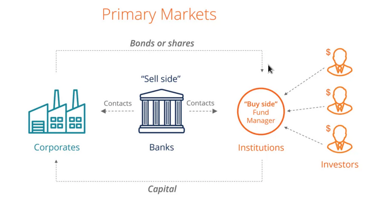
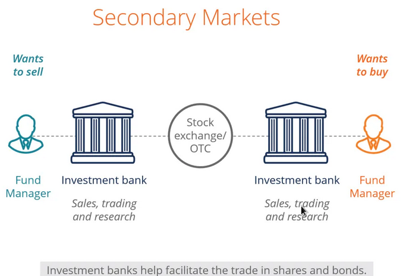
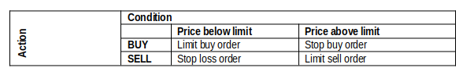

```{r setup, include=FALSE}
knitr::opts_chunk$set(echo = FALSE, message = FALSE, warning = FALSE)
library(kableExtra)
library(tidyverse)
```

## Background

### What are Financial Markets?

Financial markets, from the name itself, are a type of marketplace that provides an avenue for the sale and purchase of assets such as bonds, stocks, foreign exchange, and derivatives. Often, they are called by different names, including “Wall Street” and “capital market,” but all of them still mean one and the same thing. Simply put, businesses and investors can go to financial markets to raise money to grow their business and to make more money, respectively.

To state it more clearly, let us imagine a bank where an individual maintains a savings account. The bank can use their money and the money of other depositors to loan to other individuals and organizations and charge an interest fee.

The depositors themselves also earn and see their money grow through the interest that is paid to it. Therefore, the bank serves as a financial market that benefits both the depositors and the debtors.
Types of Financial Markets

There are so many financial markets, and every country is home to at least one, although they vary in size. Some are small while some others are internationally known, such as the New York Stock Exchange (NYSE)  that trades trillions of dollars on a daily basis. 

### Types of financial markets.

1. Stock market

The stock market trades shares of ownership of public companies. Each share comes with a price, and investors make money with the stocks when they perform well in the market. It is easy to buy stocks. The real challenge is in choosing the right stocks that will earn money for the investor.

There are various indices that investors can use to monitor how the stock market is doing, such as the NSE 20 share index and NASI (in Kenya), Dow Jones Industrial Average (DJIA) and the S&P 500 (In the United States) and so on. When stocks are bought at a cheaper price and are sold at a higher price, the investor earns from the sale, called the capital gain. The investor also makes money from dividends on the shares.

2. Bond market

The bond market offers opportunities for companies and the government to secure (borrow) money to finance a project or investment. In a bond market, investors buy bonds from a company, and the company returns the amount of the bonds within an agreed period, plus interest.

3. Commodities market

The commodities market is where traders and investors buy and sell natural resources or commodities such as corn, oil, meat, and gold. A specific market is created for such resources because their price is unpredictable. There is a commodities futures market wherein the price of items that are to be delivered at a given future time is already identified and sealed today.

4. Derivatives market

Such a market involves derivatives or contracts whose value is based on the market value of the asset being traded. The futures mentioned above in the commodities market is an example of a derivative.
Functions of the Markets

### Role of Financial Markets

The role of financial markets in the success and strength of an economy cannot be underestimated. Here are four important functions of financial markets:

1. Puts savings into more productive use

As mentioned in the example above, a savings account that has money in it should not just let that money sit in the vault. Thus, financial markets like banks open it up to individuals and companies that need a home loan, student loan, or business loan.

2. Determines the price of securities

Investors aim to make profits from their securities. However, unlike goods and services whose price is determined by the law of supply and demand, prices of securities are determined by financial markets.

3. Makes financial assets liquid

Buyers and sellers can decide to trade their securities anytime. They can use financial markets to sell their securities or make investments as they desire.

4. Lowers the cost of transactions

In financial markets, various types of information regarding securities can be acquired without the need to spend.
Importance of Financial Markets

### Recap

There are many things that financial markets make possible, including the following:

- Financial markets provide a place where participants like investors and debtors, regardless of their size, will receive fair and proper treatment.

- They provide individuals, companies, and government organizations with access to capital.

- Financial markets help lower the unemployment rate because of the many job opportunities it offers

## Real assets versus financial assets

The material wealth of a society is determined ultimately by the productive capacity of its economy—the goods and services that can be provided to its members. This productive capacity is a function of the real assets of the economy: the land, buildings, knowledge, and machines that are used to produce goods and the workers whose skills are necessary to use those resources. Together, physical and “human” assets generate the entire spectrum of output produced and consumed by the society. 

In contrast to such real assets are financial assets such as stocks or bonds. These assets, per se, do not represent a society’s wealth. Shares of stock are no more than sheets of paper or more likely, computer entries, and do not directly contribute to the productive capacity of the economy. Instead, financial assets contribute to the productive capacity of the economy indirectly, because they allow for separation of the ownership and management of the firm and facilitate the transfer of funds to enterprises with attractive investment opportunities. 

Financial assets certainly contribute to the wealth of the individuals or firms holding them. This is because financial assets are claims to the income generated by real assets or claims on income from the government.

## Market microstructure

The field that studies market design of financial markets is called “Market Microstructure”. Garman (1976) was the first to introduce this terminology when writing his paper on market making and inventory holding costs entitled “Market Microstructure”. Market microstructure deals with the economic forces behind trades, quotes and prices on markets in general and financial markets in particular.

## Classifying Financial Markets (Where Securities are Traded)

In the exchange of assets, there are several different types of markets to facilitate trade. Each market operates under different trading mechanisms, which affect liquidity and control.

These three are the main types of markets:

- Dealers (Over-the-counter)
- Exchanges
- Brokers

### Dealer Markets

A dealer market operates with a dealer that acts as a counterparty for both buyers and sellers. The dealer sets bid and asks prices for the security in question, and will trade with any investor willing to accept those prices. Securities sold by dealers are sometimes known as traded over-the-counter (OTC).

In doing so, the dealer provides liquidity in the market at the cost of a small premium. In other words, dealers will often set bid prices lower than the market and ask prices higher. The spread between these prices is the profit the dealer makes. In return, the dealer assumes counterparty risk.

Dealer markets are less common in stocks, but more common in bonds and currency. Dealer markets are also appropriate for futures and options, or other standardized contracts and derivatives. Finally, the foreign exchange market is usually operated through dealers, with banks and currency exchanges acting as the dealer intermediary.

Of the three types of markets, the dealer market is usually the most liquid.

### Broker Markets

A broker market operates by finding a counterparty to both buyers and sellers.  When dealers act as the counterparty, the delay with brokers finding an appropriate counterparty results in less liquidity in brokered markets.

Traditionally, stock markets were brokered. Stockbrokers would try to find an appropriate counterparty for their client on the trading floor. This is the stereotypical image that Wall Street used to be known for, with men and women in suits yelling at each other while holding pieces of paper noting their clients’ orders.

Broker markets are used for all manner of securities, especially those with initial issues. An IPO, for example, will usually be launched through an investment bank, who brokers the issue trying to find subscribers. This is also similar for new bond issues. Finally, brokered markets are also appropriate for tailored or custom products.

### Exchanges

Of the three types of markets, the exchange is the most automated, however, if no buyers and sellers are able to meet in terms of price, no trades execute.

The stock market is no longer a brokered market, having transitioned to being an automated exchange. Trades are executed based on order books that match buyers with sellers.

The advantage of the exchange is the provision of a central location for buyers and sellers to find their own counterparties. Exchanges are automated, requiring no broker or dealer intermediary.

Exchanges are most appropriate for standardized securities. These include stocks, bonds, futures, contracts, and options. Exchanges will typically specify characteristics for the securities traded on the exchange.


#### Stock exchanges

A stock exchange is an institution, organization or association that serves as a market for trading financial instruments such as stocks, bonds and their related derivatives. Most modern stock exchanges, like NYSE Euronext, JSE and the NSE have both a trading floor and an electronic trading system. The first stock exchanges date back to the Middle Age in Europe with debt trading between merchants. However the first stock trading can be found in the 17th century with the creation of various companies to explore European colonies such as the Dutch East India Company. Historically stocks and bonds were traded in a physical place or building with traders gathering on the floor and exchanging financial titles by hand.

Please read more about stock exchanges [here](https://en.wikipedia.org/wiki/Stock_exchange) <https://en.wikipedia.org/wiki/Stock_exchange> and [here](https://corporatefinanceinstitute.com/resources/knowledge/trading-investing/stock-market/) <https://corporatefinanceinstitute.com/resources/knowledge/trading-investing/stock-market/>.

## How securities are traded

When firms need to raise capital, they may choose to sell (or float) new securities. These new issues of stocks, bonds, or other securities typically are marketed to the public by investment bankers in what is called the primary market. Purchase and sale of already issued securities among private investors takes place in the secondary market. There are two types of primary market issues of common stock. Initial public offerings, or IPOs, are stocks issued by a formerly privately owned company selling stock to the public for the first time. Seasoned new issues are offered by companies that already have floated equity. 

A sale by EABL of new shares of stock, for example, would constitute a seasoned new issue. We also distinguish between two types of primary market issues: a public offering, which is an issue of stock or bonds sold to the general investing public that can then be traded on the secondary market; and a private placement, which is an issue that is sold to a few wealthy or institutional investors at most, and, in the case of bonds, is generally held to maturity.

## Investment Bankers and Underwriting

Public offerings of both stocks and bonds typically are marketed by investment bankers, who in this role are called underwriters. More than one investment banker usually markets the securities. A lead firm forms an underwriting syndicate of other investment bankers to share the responsibility for the stock issue.

The bankers advise the firm regarding the terms on which it should attempt to sell the securities. A preliminary registration statement must be filed with the CMA describing the issue and the prospects of the company. This preliminary prospectus is known as a red herring because of a statement printed in red that the company is not attempting to sell the security before the registration is approved. When the statement is finalized and approved by the CMA, it is called the prospectus. At this time the price at which the securities will be offered to the public is announced.

In a typical underwriting arrangement the investment bankers purchase the securities from the issuing company and then resell them to the public. The issuing firm sells the securities to the underwriting syndicate for the public offering price less a spread that serves as compensation to the underwriters. This procedure is called a firm commitment. The underwriters receive the issue and assume the full risk that the shares cannot in fact be sold to the public at the stipulated offering price. 

An alternative to firm commitment is the best-efforts agreement. In this case the investment banker agrees to help the firm sell the issue to the public but does not actually purchase the securities. The banker simply acts as an intermediary between the public and the firm and thus does not bear the risk of being unable to resell purchased securities at the offering price. The best-efforts procedure is more common for initial public offerings of common stock, for which the appropriate share price is less certain.

## Shelf Registration
Shelf registration allows firms to register securities and gradually sell them to the public for two years after the initial registration. Because the securities are already registered, they can be sold on short notice with little additional paperwork. In addition, they can be sold in small amounts without incurring substantial flotation costs. The securities are “on the shelf,” ready to be issued, which has given rise to the term shelf registration. In Kenya, we have no example of firms that have done shelf registration. 

## Private Placements
Primary offerings can also be sold in a private placement rather than a public offering. In this case, the firm (using an investment banker) sells shares directly to a small group of institutional or wealthy investors. Private placements can be far cheaper than public offerings.

## Initial Public Offerings
Investment bankers manage the issuance of new securities to the public. Once the CMA has commented on the registration statement and a preliminary prospectus has been distributed to interested investors, the investment bankers organize road shows in which they travel around the country to publicize the imminent offering (Often through the media). These road shows serve two purposes.

First, they attract potential investors and provide them information about the offering. Second, they collect for the issuing firm and its underwriters information about the price at which they will be able to market the securities. Large investors communicate their interest in purchasing shares of the IPO to the underwriters; these indications of interest are called a book and the process of polling potential investors is called bookbuilding. The book provides valuable information to the issuing firm because large institutional investors often will have useful insights about the market demand for the security as well as the prospects of the firm and its competitors. It is common for investment bankers to revise both their initial estimates of the offering price of a security and the number of shares offered based on feedback from the investing community.

## Where in a Stock Exchange are Securities Traded

1. The Primary market

What is the Primary Market?

The trading activities of the capital markets are separated into the primary market and secondary market.

The primary market is the financial market where **new** securities are issued and become available for trading by individuals and institutions. Here, firms issue securities and in return receive funds from investors.



The primary market is where companies issue a new security, not previously traded on any exchange. A company offers securities to the general public to raise funds to finance its long-term goals. The primary market may also be called the New Issue Market (NIM). In the primary market, securities are directly issued by companies to investors. Securities are issued either by an Initial Public Offer (IPO) or a Further Public Offer (FPO) OR Seasoned new issue.

An IPO is the process through which a company offers equity to investors and becomes a publicly-traded company. Through an IPO, the company is able to raise funds and investors are able to invest in a company for the first time. Similarly, an FPO is a process by which already listed companies offer fresh equity in the company. Companies use FPOs to raise additional funds from the general public.

Below are some of the ways in which companies raise funds from the primary market:

- Public Issue

This is the most common way to issue securities to the general public. Through an IPO, the company is able to raise funds. The securities are listed on a stock exchange for trading purposes.

- Rights Issue

When a company wants to raise more capital from existing shareholders, it may offer the shareholders more shares at a price discounted from the prevailing market price. The number of shares offered is on a pro-rata basis. This process is known as a Rights Issue.

- Preferential Allotment or Private Placement

When a listed company issues shares to a few individuals at a price that may or may not be related to the market price, it is termed a preferential allotment. The company decides the basis of allotment and it is not dependent on any mechanism such as pro-rata or anything else.

2. The secondary market

The secondary market is where existing shares, debentures, bonds, etc. are traded among investors. Securities that are offered first in the primary market are thereafter traded on the secondary market. The trade is carried out between a buyer and a seller, with the stock exchange facilitating the transaction. In this process, the issuing company is not involved in the sale of their securities. For example if you want to buy shares of EABL, or Safaricom, or Stanchart currently, you would go to the NSE Secondary market. However, During an IPO, rights issue or private placement, the NSE will serve as a primary market.



3. Over the counter market

In an over-the-counter (OTC) market any security may be traded there, but the OTC market is not a formal exchange. There are no membership requirements for trading, nor are there listing requirements for securities (Except at NASDAQ (?), the computer-linked network for trading of OTC securities in the USA). In the OTC market thousands of brokers register with the regulators as dealers in OTC securities. 

Security dealers quote prices at which they are willing to buy or sell securities. A broker can execute a trade by contacting the dealer listing an attractive quote. A good example of OTC is the forex market. In 1971 the National Association of Securities Dealers Automated Quotation system, or NASDAQ, began to offer immediate information on a computer- linked system of bid and asked prices for stocks offered by various dealers. The bid price is that at which a dealer is willing to purchase a security; the asked price is that at which the dealer will sell a security. 

The systems allows a dealer who receives a buy or sell order from an investor to examine all current quotes, contact the dealer with the best quote, and execute a trade. Securities of more than 6,000 firms are quoted on the system, which is now called the NASDAQ Stock Market. (NB: PLEASE DOWNLOAD FULL NOTES FOR OTC FROM F&D: REFER TO COURSE OUTLINE).


```{r}
tibble::tribble(
                                                                                                                                 ~Primary.Market,                                                                                                ~Secondary.Market,
    "It is a way of issuing fresh shares in the market. It is also called New Issue Market. A major component of the primary market is the IPO.",             "It is a place where already issued or existing shares are traded. It is called After Issue Market.",
                                       "The amount received from the issue of shares goes to the company for their business expansion purposes.", "The amount invested by the buyer of shares goes to the seller, and hence the company doesn’t receive anything.",
                                                                                      "Securities are issued by the companies to the investors.",                "Securities are exchanged between buyers and sellers, and stock exchanges facilitates the trade.",
                                                   "The securities are all issued at one price for all investors participating in the offering.",                                                                  "Securities are exchanged at the market price.",
                                                                                   "The primary market doesn’t provide liquidity for the stock.",                                                          "The secondary market provides liquidity to the stock.",
                                                                                                           "Underwriters act as intermediaries.",                                                                                 "Brokers act as intermediaries.",
                                                                                        "On the primary market, security can be sold just once.",                                             "On the secondary market, securities can be sold innumerable times."
    ) %>% 
    
    kbl(booktabs = TRUE, 
        
        caption = "Primary versus Secondary Market") %>%
    
    kable_classic(full_width = TRUE, 
                                                                      latex_option = "striped")

```


4. The Third and Fourth Markets

The third market refers to trading of exchange-listed securities on the OTC market. The fourth market refers to direct trading between investors in exchange-listed securities without benefit of a broker. The direct trading among investors that characterizes the fourth market has exploded in recent years due to the advent of the electronic communication network, or ECN.

## Trading in Exchanges

### The participants

The investor places an order with a broker. The brokerage firm owning a seat on the exchange contacts its commission broker, who is on the floor of the exchange, to execute the order. A dealer, in addition to being a broker, trades on his/ her own account.

The specialist is central to the trading process. Specialists maintain a market in one or more listed securities. All trading in a given stock takes place at one location on the floor of the exchange called the specialist’s post. At the specialist’s post is a computer monitor, called the Display Book, which presents all the current offers from interested traders to buy or sell shares at various prices as well as the number of shares these quotes are good for. 

Investors can either be retail (buy or sell small quantities of securities, mostly households), or institutional (who deal large blocks of trade, e.g. NSSF, Investment companies). A few wealthy individuals also do deal large quantities of securities.
Trading platforms (Refer to Competition on financial markets pp. 5-13)

### Types of Orders

1. Market order

Market orders are simply buy or sell orders that are to be executed immediately at current market prices. For example, an investor might call his broker and ask for the market price of KENOL. The retail broker will wire this request to the commission broker on the floor of the exchange, who will approach the specialist’s post and ask the specialist for best current quotes. Finding that the current quotes are Ksh. 100 per share bid and Ksh. 100.15 asked, the investor might direct the broker to buy 100 shares “at market,” meaning that he is willing to pay Ksh. 100.15 per share for an immediate transaction.

2. Limit order
Investors may also place limit orders, whereby they specify prices at which they are willing to buy or sell a security. If the stock falls below the limit on a limit buy order then the trade is to be executed. If KENOL is selling at Ksh. 100 bid, Ksh. 100.15 asked, for example, a limit-buy order may instruct the broker to buy the stock if and when the share price falls below Ksh. 95. Correspondingly, a limit-sell order instructs the broker to sell as soon as the stock price goes above the specified limit.

The table below illustrates the limit orders.



### Block Sales
 This is where Institutional investors frequently trade blocks of several thousand shares of stock.

## Trading Costs

Part of the cost of trading a security is obvious and explicit. Your broker must be paid a commission. Individuals may choose from two kinds of brokers: full-service or discount. Full-service brokers, who provide a variety of services, often are referred to as account executives or financial consultants. Besides carrying out the basic services of executing orders, holding securities for safekeeping, extending margin loans, and facilitating short sales, normally they provide information and advice relating to investment alternatives. Full-service brokers usually are supported by a research staff that issues analyses and forecasts of general economic, industry, and company conditions and often makes specific buy or sell recommendations.

### Buying on Margin

When purchasing securities, investors have easy access to a source of debt financing called brokers’ call loans- the act of taking advantage of brokers’ call loans is called buying on margin.

Purchasing stocks on margin means the investor borrows part of the purchase price of the stock from a broker. The broker, in turn, borrows money from banks at the call money rate to finance these purchases, and charges its clients that rate plus a service charge for the loan. All securities purchased on margin must be left with the brokerage firm in street name, because the securities are used as collateral for the loan.

### Short Sales

A short sale allows investors to profit from a decline in a security’s price. An investor borrows a share of stock from a broker and sells it. Later, the short seller must purchase a share of the same stock in the market in order to replace the share that was borrowed. This is called covering the short position. The short seller anticipates the stock price will fall, so that the share can be purchased at a lower price than it initially sold for; the short seller will then reap a profit. Short sellers must not only replace the shares but also pay the lender of the security any dividends paid during the short sale.

### Insider Trading

One of the important restrictions on trading involves insider trading. It is illegal for anyone to transact in securities to profit from inside information, that is, private information held by officers, directors, or major stockholders that has not yet been divulged to the public. 

The difficulty is that the definition of insiders can be ambiguous. Although it is obvious that the chief financial officer of a firm is an insider, it is less clear whether the firm’s biggest supplier can be considered an insider. However, the supplier may deduce the firm’s near-term prospects from significant changes in orders. This gives the supplier a unique form of private information, yet the supplier does not necessarily qualify as an insider.

These ambiguities plague security analysts, whose job is to uncover as much information as possible concerning the firm’s expected prospects. The distinction between legal private information and illegal inside information can be fuzzy.

### Trends in Financial Markets

1. Demutualization of stock exchanges.

In demutualization, the ownership of the stock exchanges is being opened up. Note that stock markets have traditionally operated as a member’s only club. The trend is towards opening up ownership to other investor and the public and listing the shares of the stock exchange.

2. ICT and stock markets (CDS, Electronic trading)
ICT has profound effects on the trading of stocks. You can now buy or sell shares online. CDS accounts have come to replace the physical share certificates and helped lower cost, and speed up trading of shares.

3. Globalization.
As an investor, you have the option of investing in other markets (investing offshore) e.g. the NYSE. This has been made possible by ICT.

4. Securitization.
Here pools of loans typically are aggregated into pass-through securities, such as mortgage pool pass-through. Then, investors can invest in securities backed by those pools. The transformation of these pools into standardized securities enables issuers to deal in a volume large enough that they can bypass intermediaries. We have already discussed this phenomenon in the context of the securitization of the mortgage market.

NB: (Download the OTC notes from F&D as per the course outline)
(Be sure to distinguish commodity vs. financial markets; exchange markets vs. OTC markets)


