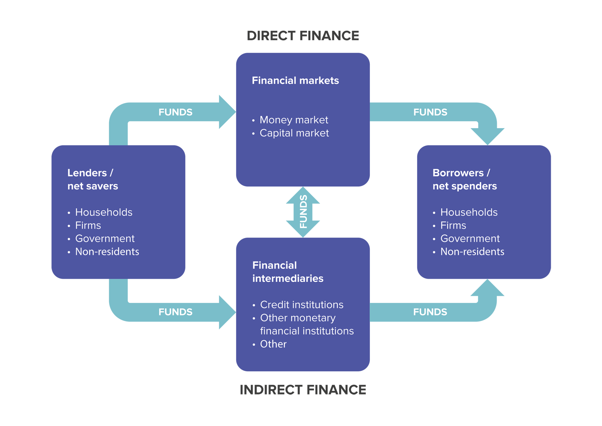

```{r setup, include=FALSE}
knitr::opts_chunk$set(echo = TRUE)
```


# The Financial System
The purpose of this course is to provide you with the tools you need to understand the modern financial system. First, you should be familiar with the three major components of the financial system:

1. Financial assets
2. Financial institutions / financial intermediaries.
3. The Central Bank and other financial regulators

We will briefly consider each of these components.

## Financial Assets
An asset is anything of value owned by a person or a firm. A financial asset is a financial claim, which means that if you own a financial asset, you have a claim on someone else to pay you money. For instance, a bank account is a financial asset because it represents a claim you have against a bank to pay you an amount of money equal to the value of your account. Economists divide financial assets into those that are securities and those that aren’t. 

A security is tradable, which means that it can be bought and sold in a financial market. Financial markets are places or channels for buying and selling stocks, bonds, and other securities, such as the Nairobi Securities Exchange, and New York Stock Exchange. If you own a share of stock in Safaricom or Bamburi Cement, you own a security because you can sell that share in the stock market. If you have a checking account at Equity bank or Barclays, you can’t sell it. So, your checking account is an asset but not a security. The following are five key categories of assets:

1. Money
2. Stocks
3. Bonds
4. Foreign exchange
5. Securitized loans

We now briefly discuss these five key assets.

### Money 

Although we typically think of “money” as coins and paper currency, even the narrowest government definition of money includes funds in bank accounts. In fact, economists have a very general definition of money: Money is anything that people are willing to accept in payment for goods and services or to pay off debts. The money supply is the total quantity of money in the economy. 

### Stocks 

Stocks, also called equities, are financial securities that represent partial ownership of a corporation. When you buy a share of Safaricom stock, you become a Safaricom shareholder, and you own part of Safaricom, although only a tiny part because Safaricom has issued millions of shares of stock. When Safaricom sells additional stock, it is doing the same thing that the owner of a small firm does when she takes on a partner: increasing the funds available to the firm, its financial capital, in exchange for increasing the number of the firm’s owners. 

As an owner of a share of stock in a corporation, you have a legal claim to a share of the corporation’s assets and to a share of its profits, if there are any. Firms keep some of their profits as retained earnings and pay the remainder to shareholders in the form of dividends, which are payments corporations typically make every year.

### Bonds 

When you buy a bond issued by a corporation or a government, you are lending the corporation or the government a fixed amount of money. The interest rate is the cost of borrowing funds (or the payment for lending funds), usually expressed as a percentage of the amount borrowed. For instance, if you borrow Ksh.1,000 from a friend and pay him back Ksh.1,100 a year later, the interest rate on the loan was Ksh.100/Ksh.1,000 = 0.10, or 10%. 

Bonds typically pay interest in fixed Shilling amounts called coupons. When a bond matures, the seller of the bond repays the principal. For example, if you buy a Ksh.1,000 bond issued by EQUITY Bank  that has a coupon of Ksh.65 per year and a maturity of 30 years, EQUITY will pay you Ksh.65 per year for the next 30 years, at the end of which EQUITY will pay you the Ksh.1,000 principal. A bond that matures in one year or less is a short-term bond. A bond that matures in more than one year is a long-term bond. Bonds can be bought and sold in financial markets, so, like stocks, bonds are securities.

### Foreign Exchange

Many goods and services purchased in a country are produced outside that country. Similarly, many investors buy financial assets issued by foreign governments and firms. To buy foreign goods and services or foreign assets, a domestic business or a domestic investor must first exchange domestic currency for foreign currency. For example, consumer electronics shops exchanges Kenya Shillings for Japanese yen when importing Sony televisions. 

Foreign exchange refers to units of foreign currency. The most important buyers and sellers of foreign exchange are large banks. Banks engage in foreign currency transactions on behalf of investors who want to buy foreign financial assets. Banks also engage in foreign currency transactions on behalf of firms that want to import or export goods and services or to invest in physical assets, such as factories, in foreign countries.

### Securitized Loans 

If you lack the money to pay the full price of a car or house in cash, you can apply for a loan at a bank. Similarly, if a developer wants to build a new office building or shopping mall, the developer can also take out a loan with a bank. Until about 30 years ago, banks made loans with the intention of making profits by collecting interest payments on a loan until the loan was paid off. It wasn’t possible to sell most loans in financial markets, so loans were financial assets but not securities. 

Then, Western Governments (especially in The USA) and some financial firms created markets for many types of loans. Loans that banks could sell on financial markets became securities, so the process of converting loans into securities is known as securitization. To take one example, a bank might grant a mortgage, which is a loan a borrower uses to buy a home, and sell it to a government-sponsored enterprise or a financial firm that will bundle the mortgage together with similar mortgages granted by other banks. This bundle of mortgages will form the basis of a new security called a mortgage-backed security that will function like a bond. Just as an investor can buy a bond from EQUITY, the investor can buy a mortgage-backed security from the government agency or financial firm.

## Financial Institutions & Financial Intermediaries

The financial system matches savers and borrowers through two channels: 

- Banks and other financial intermediaries and 
- Financial markets. 

These two channels are distinguished by how funds flow from savers, or lenders, to borrowers and by the financial institutions involved. Funds flow from lenders to borrowers indirectly through financial intermediaries, such as banks, or directly through financial markets, such as the Nairobi Securities Exchange (***See Figure 1 at the end of the handout on direct and indirect Finance***). 

If you get a loan from a bank to buy a car, economists refer to this flow of funds as indirect finance. The flow is indirect because the funds the bank lends you come from people who have put money in deposits in the bank; in that sense, the bank is not lending its own funds directly to you. On the other hand, if you buy stock that a firm has just issued, the flow of funds is direct finance because the funds are flowing directly from you to the firm. Savers and borrowers can be households, firms, or governments, both domestic and foreign. The figure below shows that the financial system channels funds from savers to borrowers and channels returns back to savers, both directly and indirectly. Savers receive their returns in various forms, including dividend payments on stock, coupon payments on bonds, and interest payments on loans.

### Financial Intermediaries 

Commercial banks are the most important financial intermediaries. Commercial banks play a key role in the financial system by taking in deposits from households and firms and investing most of those deposits, either by making loans to households and firms or by buying securities, such as government bonds or securitized loans. Most households rely on borrowing money from banks when they purchase “big-ticket items,” such as cars or homes. 

Similarly, many firms rely on bank loans to meet their short-term needs for credit, such as funds to pay for inventories or to meet their payrolls. Many firms rely on bank loans to bridge the gap between the time they must pay for inventories or meet their payrolls and when they receive revenues from the sales of goods and services. Some firms also rely on bank loans to meet their long-term credit needs, such as funds they require to physically expand the firm.

### Nonbank Financial Intermediaries 
Some financial intermediaries, such as Building societies, and credit unions, are legally distinct from banks, although these “nonbanks” operate in a very similar way by taking in deposits and making loans. Other financial intermediaries include insurance companies, pension funds, mutual funds, hedge funds, and investment banks. Although these institutions don’t at first glance appear to be very similar to banks, they fulfil a similar function in the financial system by channelling funds from savers to borrowers. 

We briefly describe each of these financial intermediaries:


#### Insurance companies

Insurance companies specialize in writing contracts to protect their policyholders from the risk of financial losses associated with particular events, such as automobile accidents or fires. Insurance companies collect premiums from policyholders, which the companies then invest to obtain the funds necessary to pay claims to policyholders and to cover their other costs. So, for instance, when you and other people buy an automobile insurance policy, the insurance company may lend the premiums you pay to a hotel chain that needs funds to expand.

#### Pension funds

For many people, saving for retirement is the most important form of saving. Pension funds like NSSF invest contributions from workers and firms in stocks, bonds, and mortgages to earn the money necessary to pay pension benefit payments during workers retirements. With about Billion in assets, private and state pension funds are an important source of demand for financial securities.

#### Mutual funds 

A mutual fund, such as Old Mutual, obtains money by selling shares to investors. The mutual fund then invests the money in a portfolio of financial assets, such as stocks and bonds, typically charging a small management fee for its services. By buying shares in a mutual fund, savers reduce the costs they would incur if they were to buy many individual stocks and bonds. 

Small savers who have only enough money to buy a few individual stocks and bonds can also lower their investment risk by buying shares in a mutual fund because most mutual funds hold a large number of stocks and bonds. If a firm issuing a stock or a bond declares bankruptcy, causing the stock or bond to lose all of its value, the effect on a mutual fund’s portfolio is likely to be small. The effect might be devastating, though, on a small investor who had invested most of his or her savings in the stock or bond. Because mutual funds are willing to buy back their shares at any time, they also provide savers with easy access to their money.

#### Hedge funds

Hedge funds, such as the Quantum Group run by billionaire George Soros, are similar to mutual funds in that they accept money from investors and use the funds to buy a portfolio of assets. However, a hedge fund typically has no more than 99 investors, all of whom are wealthy individuals or institutions such as pension funds. Hedge funds typically make riskier investments than do mutual funds, and they charge investors much higher fees.

#### Investment Banks

Investment banks, such as Dyer and Blair, differ from commercial banks in that they do not take in deposits and rarely lend directly to households. Instead, they concentrate on providing advice to firms issuing stocks and bonds or considering mergers with other firms. They also engage in underwriting, in which they guarantee a price to a firm issuing stocks or bonds and then make a profit by selling the stocks or bonds at a higher price. In the late 1990s, investment banks increased their importance as financial intermediaries by becoming heavily involved in the securitization of loans, particularly mortgage loans. Investment banks also began to engage in proprietary trading in which they hoped to profit by buying and selling securities.

Other non-bank institutions include building societies, micro-finance institutions, forex bureaus, and credit unions.

### Financial Markets 
Financial markets are places or channels for buying and selling stocks, bonds, and other securities. Traditionally, financial markets have been physical places, such as the Nairobi Securities Exchange, or the London Stock Exchange, which is located in London. On these exchanges, stocks and bonds were traded by dealers who would meet face-to-face. Today, most securities trading takes place electronically between dealers linked by computers and is referred to as “over-the-counter” trading. NASDAQ, which originally stood for the National Association of Securities Dealers Automated Quotation System, is an over-the-counter market on which the stocks of many high-tech firms such as Apple and Intel are traded. 

Stocks and bonds sold in a particular market are said to be “listed” on that market. For instance, Safaricom is listed on the Nairobi Securities Exchange, and Apple is listed on NASDAQ. Economists make a distinction between primary markets and secondary markets. A primary market is a financial market in which stocks, bonds, and other securities are sold for the first time. When a company first sells stock to the public, which is called an initial public offering (IPO), the stock is sold in the primary market. A secondary market is a financial market in which investors buy and sell already existing securities. Primary and secondary markets can be in the same physical—or virtual—place.

## The Central Bank and Other Financial Regulators

In most markets, the government plays a very limited role in deciding what gets produced, how it gets produced, what prices firms charge, or how firms operate. But policymakers in Kenya and most other countries view the financial system as different from the markets for most goods and services. It is different because, when left largely alone, the financial system has experienced periods of instability that have led to economic recessions. The government of Kenya has several agencies that are devoted to regulating the financial system, including these:

- The Central Bank of Kenya (CBK).
- Insurance Regulatory Authority (IRA).
- Capital Markets Authority (CMA).
- Retirement benefits authority (RBA).
- Sacco Societies Regulatory Authority (SASRA).

## What Does the Financial System Do?
The key services that the financial system provides to savers and borrowers: risk sharing, liquidity, information, payment services and financial intermediation. Financial services firms provide these services in different ways, which makes different financial assets and financial liabilities more or less attractive to individual savers and borrowers. We can look briefly at each of these three key services.

### Risk Sharing 

Risk is the chance that the value of financial assets will change relative to what you expect. One advantage of using the financial system to match individual savers and borrowers is that it allows the sharing of risk. For example, if you buy a share of Safaricom stock for Ksh. 3.50, that share may be worth Ksh. 1.00 or Ksh. 5.00 in one year’s time, depending on how profitable it is. Most individual savers seek a steady return on their assets rather than erratic swings between high and low earnings. One way to improve the chances of a steady return is by holding a portfolio of assets. 

For example, you might hold some bonds, some shares of stock, and some shares in a mutual fund. Although during any particular period one asset or set of assets may perform well and another not so well, overall the returns tend to average out. This splitting of wealth into many assets is known as diversification. The financial system provides risk sharing by allowing savers to hold many assets. The ability of the financial system to provide risk sharing makes savers more willing to buy stocks, bonds, and other financial assets. This willingness, in turn, increases the ability of borrowers to raise funds in the financial system. The financial system also helps reduce risk through provision of pure insurance services, life or general, wholesale and retail, which enable people or businesses to lay off exposure to risks by pooling their exposures with others.

### Liquidity 

The second service that the financial system offers savers and borrowers is liquidity, which is the ease with which an asset can be exchanged for money. Savers view the liquidity of financial assets as a benefit. When they need their assets for consumption or investment, they want to be able to sell them easily. More liquid assets can be quickly and easily exchanged for money, while less liquid—or illiquid— assets can be exchanged for money only after a delay or by incurring costs. For instance, if you want to buy groceries or clothes, you can easily do so with notes/coins or by using a debit card (ATM) linked to your bank account. 

Selling your car, however, takes more time because personal property is illiquid. To sell your car, you may incur the costs of advertising or have to accept a relatively low price from a used car dealer. By holding financial claims on a factory—such as stocks or bonds issued by the firm that owns the factory—individual investors have more liquid savings than they would if they owned the machines in the factory. Investors could convert the stocks or bonds into money much more easily than they could convert a specialized machine into money. By creating markets in spot or short term futures, foreign exchange, e.t.c., the financial system enhances liquidity.

### Information 

A third service of the financial system is the collection and communication of information, or facts about borrowers and expectations of returns on financial assets. Your local bank is a warehouse of information. It collects information on borrowers to forecast their likelihood of repaying loans. Borrowers fill out detailed loan applications, and the bank’s loan officers determine how well each borrower is doing financially. Because the bank specializes in collecting and processing information, its costs for information gathering are lower than yours would be if you tried to gather information on a pool of borrowers. 

The profits the bank earns on its loans are partly compensation to it for investing in information gathering. Financial markets convey information to both savers and borrowers by determining the prices of stocks, bonds, and other securities. When the price of your shares of Safaricom rises, you know that other investors must expect that Safaricom profits will be higher. This information can help you decide whether to continue investing in the stock. Likewise, the managers of Safaricom can use the price of the firm’s stock to determine how well investors think the firm is doing. For example, a major increase in Safaricom’s stock price conveys investors’ positive outlook for the firm. Safaricom may use this information in deciding whether to sell more stock or bonds to finance an expansion of the firm. The incorporation of available information into asset prices is an important feature of well-functioning financial markets.

### Payment services

The financial system provides payment services, both wholesale and retail. In this way, trade is facilitated that drives the economy. Especially important is the provision of cross border payment services that makes global trade more efficient.

### Financial intermediation
The payment system mediates between the providers of funds (savers) and users of funds (investors/ consumers). This intermediation service plays a crucial role in capital allocation within the economy.

# SUMMARY
The financial system channels funds from savers to borrowers. The three key components of the financial system are financial assets, financial institutions, and the Central Bank and other financial regulators. The most important financial assets are money, stocks, bonds, foreign exchange, and securitized loans. There are two channels through which funds flow from savers to borrowers: commercial banks (and other financial intermediaries) and financial markets. The flow of funds from savers to borrowers through financial intermediaries is referred to as indirect finance, and the flow through financial markets is referred to as direct finance. 

A primary market is a financial market in which stocks, bonds, and other securities are sold for the first time. A secondary market is a financial market in which investors buy and sell already existing securities. The most important financial regulator is the central bank of Kenya which also conducts s monetary policy. The financial system provides to savers and borrowers the three key services of risk sharing, liquidity, and information.

# REVIEW QUESTIONS
1. What is the difference between direct finance and indirect finance? Which involves financial intermediaries, and which involves financial markets?
2. Briefly explain why the financial system is one of the most highly regulated sectors of the economy. Briefly 3.Describe the three key services that the financial system provides to savers.
4. Briefly explain why the financial system is one of the most highly regulated sectors of the economy.
5. Why might you prefer to lend money to individuals/ businesses through a local bank rather than directly?
6. Suppose financial intermediaries did not exist and only direct finance was possible. How would this affect the process of an individual buying a car or a house?


## Direct vs Indirect Finance (Please read and distinguish them)




## Suggestions for further reading;

In addition to the resources indicated in the course outline, you may also wish to review the following.

Choudhry, M. L. (2010). The future of finance : A new model for banking and investment. New York: John Wiley & Sons, Inc.

Turner, A. (2010). What do banks do? Why credit booms and bursts occur and what can public policy do about it? In The Future of Finance: The LSE Report (pp. 1-88). London: LSE.