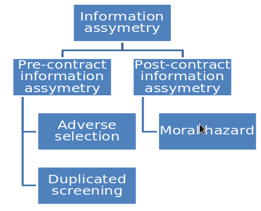
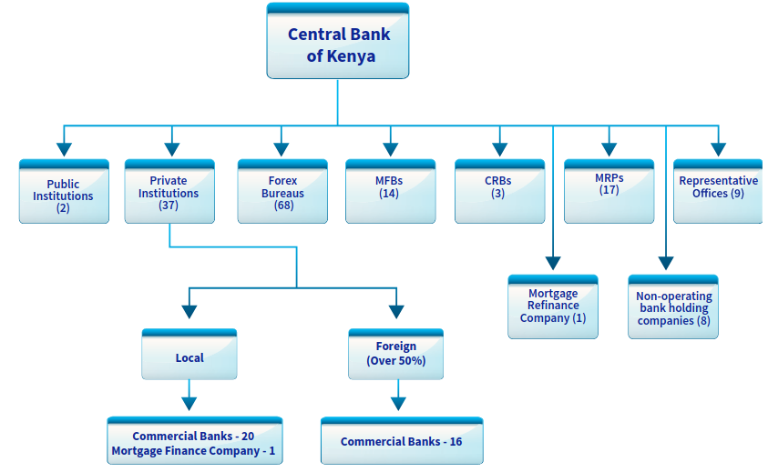

```{r setup, include=FALSE}
knitr::opts_chunk$set(echo = TRUE)
```

## Background: Financial Intermediation

Financial intermediaries are entities that intermediate between providers and users of funds. Most financial intermediaries hold large quantities of financial assets, and tend to be more leveraged (indebted). 

What makes financial intermediation necessary? This is tantamount to asking: what do financial intermediaries do that cannot be done without them? First, financial intermediaries help to resolve the pre-contract information asymmetry when they act as agents for their clients. They also resolve the post-contract information asymmetry, and do asset transformation. Transaction costs are also a key driver for the demand for services of financial intermediaries.

### Asset transformation

Financial intermediaries match non-matching providers and users of funds, enabling the pattern of providers’ assets to differ from the pattern of users’ liabilities. This intermediation of non-matching assets and liabilities entails four functions.

- **Pooling of Risks**; for example, each depositor in a bank has an indirect claim on all the mortgages, business loans, or credit card receivables owed to the bank rather than a claim to one specific mortgage or loan. The same is true for a holder of unit trusts in a mutual fund.

- **Maturity transformation** via balance sheet intermediation; a good example is banks that lend at longer average maturities than they borrow. The risk inherent in this transformation is offset by the equity (capital) cushion and the holding of a reserve of highly liquid asset (liquidity insurance achieved through lines of credit from other banks and the central bank as a lender of last resort).

- **Maturity transformation** via provision of liquidity; this gives the holder of a contractually long term asset (e.g. a share or a bond) the option of selling it immediately in a liquid market. 

**Risk-return transformation**; this is via the creation of a different mix of debt and equity investment options for savers. Under this securitization, liabilities of borrowers are ‘tranched’ with some investors buying bank subordinated debt, some senior debt and some making deposits.

### Resolving pre-contract information asymmetry 

Definition: Information asymmetry is an imbalance between two negotiating parties in their knowledge of relevant factors and details. Typically, that imbalance means that the side with more information enjoys a competitive advantage over the other party. See more information [here](https://www.techtarget.com/whatis/definition/information-asymmetry) <https://www.techtarget.com/whatis/definition/information-asymmetry>. Also Refer to Figure 1 below.

Pre-contract information asymmetry involves two kinds of information problems: adverse selection and duplicated screening. We will discuss each in turn.

- Adverse selection (The hidden information problem);

In transactions involving financial intermediaries, adverse selection problems abound. For example, a borrower will wish to overstate his credit worthiness to potential lenders in order to appear like a low-credit-risk borrower. And if the lender raises the loan interest rate in order to be compensated for the higher credit risk associated with borrowers, who misrepresent their creditworthiness, the borrowers most likely to drop out are the low-credit-risk borrowers who may either have better credit alternatives or be simply unwilling to borrow at the higher interest rate. Consequently, the lender is left with only the high-credit-risk borrowers. An F.I. like a bank can help deal with this adverse selection problem by performing the brokerage function of credit analysis to sort out borrowers of different credit risks. That is, in this case the broker specializes in credit analysis or develops the skills to process/interpret various types of credit information. This allows it to intermediate between borrowers and lenders and minimize adverse selection problems.

To understand this adverse selection (hidden information) problem better, it would be in the interest of the student to review Akerlof (1970) lemons market problem.  A simplified version is in Varian (microeconomics analysis 3rd edition, pp 466 onwards, or any other microeconomics texts and your class notes for the microeconomics course you have already taken).


- Duplicated screening, information re-usability and brokerage

Duplicated screening refers to situations in which individuals can resolve adverse selection at a cost, but there is wasteful expenditure of costly screening resources because multiple individuals end up doing the same screening. A financial intermediary can help avoid such duplication by exploiting the power of information reusability. This can be illustrated through the example given below.

Consider 100 men and 100 women (including you and me) searching for the ‘‘perfect’’ marriage partner. In order to become fully informed, each woman will need to evaluate each of the 100 men, and likewise for each of the men. Now suppose that each such evaluation (sampling) results in a fixed cost of say, Ksh. 25. Then the total cost for all participants to become fully informed would be Ksh. 500,000 (that is, $2(100 * 100 * 25))$. Or, if we let $x$ represent the size of the side of a square grid (100 people in this example), and $c$ the fixed sampling cost per unit (Ksh. 25 in this example), we have the result that the total cost equals $2cx^{2}$.

Now enter the broker! To establish a level playing field and suppress consideration of the broker’s special skills, we assume the evaluation cost per unit remains unchanged at Ksh. 25. However, the broker will need to examine each of the participants only once and hence its total cost of becoming informed is $2cx$, or Ksh. 5,000. Assuming the information is distributed at negligible cost, the saving due to the introduction of the broker is;
 
Savings = 500,000 – 5,000 = 495,000

Off course the broker will expect to earn a profit and will charge above Ksh. 5,000. But still there is still room for enormous collective savings to be realized when a broker is engaged. The saving associated with having a broker increases exponentially. 

The savings, due to the broker, derive from a peculiarity of information: its use does not result in its consumption. Most goods and services are transformed into waste as a result of being used. This is not true with information, and this is the key to understanding the broker’s role. 

If the marriage broker composes a report on a particular candidate, I can use the information without in any way compromising your ability to use the same information. The same is true for a report written by a security analyst, or for a telephone directory. This extraordinary reusability of information is what makes it compelling to have a broker, and the larger the grid, the greater the potential saving associated with reusing information.

To cement our understanding of the power of information reusability, consider one more example. Think of a very large geographic grid for Turkana District in which each intersection represents a potential oil well. Now suppose there are many oil drilling (like Tullow oil that discovered oil in Turkana) entrepreneurs, and further suppose that after drilling a dry hole the law requires that the landscape be restored to its initial condition. Thus, there is no way to know if a particular location has been drilled unless there is an operating well at a particular location. If a broker simply collects and disseminates information about the drilling activities of each explorer, the cost of re-drilling dry holes can be eliminated. Without the broker, society will bear the unnecessary cost of searching for oil in locations known to be unproductive. This aspect of information is called cross-sectional reusability; the same information can be utilized across a number of different users. Information reusability also has an inter-temporal aspect; it can be reused through time. For example, a bank that learns something about a borrower while processing its first loan application can use at least some of that information in processing future credit requests from the same borrower.


### Post-contract information asymmetry and brokerage.

In many transactions, one party to the transaction can take actions during the course of the contractual interaction that damage the interest of the other party. The reason why such behavior is possible is that these actions are 'hidden’ from the injured party and cannot be directly controlled or prevented. Such informational asymmetry is associated with moral hazard. Hence, moral hazard is also the 'hidden action' problem.

Moral hazards are quite prevalent. It is encountered in insurance, where the insured may under-invest in costly efforts to prevent adverse outcomes because the insurer absorbs the resulting loss. It is encountered in banking, where borrowers may choose excessively risky projects because the bank bears a disproportionate share of the downside risk.

The financial intermediaries’ special skills in monitoring attenuate moral hazard. For example, banks monitor their borrowers by periodically examining the borrower’s business and its financial condition and intervening in operating strategy when necessary. Insurance companies design insurance contracts and use ex-post pricing adjustments to deter moral hazard. Venture capitalists use the threat of transfer of control to ensure that the entrepreneur’s incentives do not stray too far from investors’ desires.

Thus, moral hazard provides a powerful source of economic value for the financial intermediaries to emerge as a broker that can help diminish the losses due to moral hazard.

To help crystallize the moral hazard problem, figure that you have just purchased a new car and have not been able to purchase insurance for it. How would you drive the car (assuming it is not illegal to drive a car without insurance)? What measures would you undertake to ensure it is not stolen, you do not cause an accident)? Would you loosen some of the precautions you were taking (albeit unconsciously) once you get motor insurance? 



### Transaction costs

The time and money spent in carrying out financial transactions are a major problem for people who have excess funds to lend. If you have Ksh. 1, 00,000 to lend, and you have identified an investor willing to borrow the money at 10% interest per annum for 3 years. You have to among other things, hire a lawyer to write the loan contract at a cost. 

In the case of default you will have to undergo costly court proceedings and eventually hire an auctioneer. Once you figure out the cost of making the loan, you may realize that it is not worthy lending your money.  Financial intermediaries can substantially reduce transaction costs because they have developed expertise in lowering them and they can take advantage of economies of scale.

Because financial intermediaries are able to reduce transaction costs, they make it possible for savers to provide funds indirectly to people with productive investments. In addition, financial intermediaries can provide customers with liquidity services that make it easier for customers to conduct transactions.

## Types of Financial Intermediaries

There are many ways to classify financial intermediaries.

- Nature of services offered.
Examples of brokerage services include (NB: NOT EXPECTED TO MEMORIZE THESE- JUST GET THE GENERAL UNDERSTANDING);
    * Transaction services e.g. check writing, buying/ selling securities, safekeeping, e.t.c.
    * Financial advice, example where to invest and portfolio management.
    * Screening and certification, e.g. rating of bonds.
    * Origination, example a bank initiating a loan to a borrower.
    * Issuance, example taking a security offering to the market.
    * Funding, example a bank making a loan.
    * Miscellaneous, example trust activities.
Examples of asset transformation services include;
    * Monitoring, for example a bank monitoring a borrower’s compliance with loan agreements.
    * Management expertise, example a venture capitalist running a firm.
    * Guaranteeing, like an insurance company providing insurance.
    * Liquidity creation and asset transformation, for example a bank making illiquid loans and transforming them into deposit claims that are liquid.
    
- Deposit/ non- deposit taking.
Financial intermediaries that finance (at least partly) with deposits are called deposit-type or depository, whereas those that do not finance with deposits are called non-depository.

- Capital/ Money market institutions
Capital markets instutions deal in long term financing while money market institutions deal in short term funding.


### Financial Intermediaires in Kenya (and Beyond)

Financial institutions are those organizations that are involved in providing various types of financial services to their customers. A financial institution can also be defined as that type of an institution, which performs the collection of funds from private investors and public investors and utilizes those funds in financial assets.

The financial institutions are controlled and supervised by the rules and regulations delineated by government authorities.  Examples of financial institutions are the following:

- Commercial Banks and Mortgage finance Institutions.
- Stock Brokerage Firms and Investment Banks.
- Non Banking Financial Institutions 
- Building Societies 
- Asset Management Firms
- Credit Unions 
- Insurance Companies
- Stock exchanges
- Mutual Funds.
- Hedge Funds
- Rating agencies

Some of the financial institutions also function as mediators in share markets and debt security markets. There the principal function of financial institutions is to collect funds from the investors and direct the funds to various financial services providers in search for those funds.  Financial institutions deal with various financial activities associated with bonds, debentures, stocks, loans, risk diversification, insurance, hedging, retirement planning, investment, portfolio management, and many other types of related functions. 

With the help of their functions, the financial institutions transfer money or funds to various tiers of economy and thus play a significant role in acting upon the domestic and the international economic scenario.

For carrying out their business operations, financial institutions implement different types of economic models. They assist their clients and investors to maximize their profits by rendering appropriate guidance. Financial institutions also impart a wide range of educational programs to educate the investors on the fundamentals of investment and also regarding the valuation of stock, bonds, assets, foreign exchanges, and commodities.  Financial institutions can be either private or public in nature. 

We discuss several financial institutions:

#### Commercial Banks and Mortgage (S\&L) Financial Institutions

Commercial Banks and Mortgage Finance Institutions are licensed and regulated pursuant to the provisions of the Banking Act and the Regulations and Prudential Guidelines issued thereunder. They are the dominant players in the Kenyan Banking system and closer attention is paid to them while conducting off-site and on-site surveillance to ensure that they are in compliance with the laws and regulations. 

As at December 31, 2021, the Kenyan banking sector comprised of the Central Bank of Kenya (CBK), as the regulatory authority, 38 Commercial Banks, 1 Mortgage Finance Company, 1 Mortgage Refinance Company, 9 Representative Offices of foreign banks, 14 Microfinance Banks (MFBs), 3 Credit Reference Bureaus (CRBs), 17 Money Remittance Providers (MRPs), 8 non-operating bank holding companies and 68 foreign exchange (forex)
bureaus. Out of the 39 banking institutions, 37 were privately owned while the Kenya Government had majority ownership in 2 institutions. Of the 37 privately owned banks, 21 were locally owned (the controlling shareholders are domiciled in Kenya) while 16 were foreign owned. 

The 21 locally owned institutions comprised 20 commercial banks and 1 mortgage finance company. Of the 16 foreign-owned institutions, all are commercial banks with 13 being local subsidiaries of foreign banks and 3 are branches of foreign banks. All licensed forex bureaus, microfinance banks, credit reference bureaus, money remittance providers, non-operating bank holding companies and a privately owned (some are locally owned some foreign owned). 

The banking landscape in Kenya is depicted below (see Figure 2).



To read more about the structure of the vanking industry in Kenya please refer to the [Central Bank of Kenya Banking Sector Annual Report, 2021](https://www.centralbank.go.ke/uploads/banking_sector_annual_reports/1033515790_2021%20Annual%20Report.pdf) <https://www.centralbank.go.ke/uploads/banking_sector_annual_reports/1033515790_2021%20Annual%20Report.pdf>

##### Agent banking

In 2010, the central bank has allowed for agent banking after drafting regulations for the agency banking. Agent means an entity that has been contracted by an institution and approved by the Central Bank to provide the services of the institution on behalf of the institution in the manner specified in the Guideline. Agent banking is aimed at:

- Increasing financial services outreach and to promote financial inclusion to the un-banked and under-banked population without risking the safety and soundness of the banking system; and,
- Encouraging institutions to use agents in the provision of banking services so as to reduce the cost of financial services and to foster financial inclusion, reach and depth.

(Refer to the Central Bank of Kenya website at www.centralbank.go.ke for more details)

#### Microfinance institutions
The Microfinance Act, 2006 and the Microfinance Regulations issued there under sets out the legal, regulatory and supervisory framework for the microfinance industry in Kenya. The Microfinance Act became operational with effect from 2nd May 2008. 

The principal object of the Microfinance Act is to regulate the establishment, business and operations of microfinance institutions in Kenya through licensing and supervision. The Act enables Deposit Taking Microfinance Institutions licensed by the Central Bank of Kenya to mobilize savings from the general public, thus promoting competition, efficiency and access.

It is, therefore, expected that the microfinance industry will play a pivotal role in deepening financial markets and enhancing access to financial services and products by majority of the Kenyans. There are 13 (or is it 14, please research) licensed deposit taking MFIs. Please download the list [here](https://www.centralbank.go.ke/wp-content/uploads/2016/06/Directory-of-Licenced-Microfinance-Banks.pdf) <https://www.centralbank.go.ke/wp-content/uploads/2016/06/Directory-of-Licenced-Microfinance-Banks.pdf>. Regulations for Non Deposit Taking Microfinance Institutions are yet to be put in place

#### Forex bureaus
Forex Bureaus were established and first licensed in January 1995 to foster competition in the foreign exchange market and to narrow the exchange rate spread in the market. As authorized dealers, forex bureaus conduct business and are regulated under the provisions of the Central Bank of Kenya Act (Cap 491). Currently there are one hundred and thirty (130) licensed Forex Bureaus.

#### Credit reference bureaus
Credit Reference bureaus complement the central role played by banks and other financial institutions in extending financial services within an economy. CRBs help lenders make faster and more accurate credit decisions. They collect, manage and disseminate customer information to lenders with in a provided regulatory framework – in Kenya, the Banking (Credit Reference Bureau) Regulations, 2008 which was operationalised effective 2nd February 2009. 

Credit histories not only provide necessary input for credit underwriting, but also allow borrowers to take their credit history from one financial institution to another, thereby making lending markets more competitive and, in the end, more affordable. Credit bureaus assist in making credit accessible to more people, and enabling lenders and businesses reduce risk and fraud. Sharing of information between financial institutions in respect of customer credit behavior, therefore, has a positive economic impact. 

The Kenyan banking sector was in the 80’s and 90’s saddled with a momentous Non-Performing Loans (NPLs) portfolio. This invariably led to the collapse of some banks. One of the catalysts in this scenario were “Serial defaulters”, who borrowed from various banks with no intention of repaying the loans. Undoubtedly these defaulters thrived in the “information asymmetry” environment that prevailed due to lack of a credit information sharing mechanism.

The Banking (Credit Reference Bureau) Regulations 2008 will govern licensing, operation and supervision of CRBs by the Central Bank of Kenya. The development of a sustainable information sharing industry is therefore recognized as a key component of financial sector reforms in Kenya and almost all developing and emerging economies. 

There are three (3) CBK licensed credit reference bureau in Kenya

- Credit Reference Bureau Africa Limited (Trading as TransUnion).
- Metropol Credit Reference Bureau Limited.
- Creditinfo Credit Reference Bureau Kenya Limited

More CRBs could be licensed in future thus the importance of keeping abreast with the developments in the sector. Please download the list of CRBs in Kenya [here](https://www.centralbank.go.ke/wp-content/uploads/2016/06/Directory-of-Licenced-Credit-Reference-Bureaus.pdf) <https://www.centralbank.go.ke/wp-content/uploads/2016/06/Directory-of-Licenced-Credit-Reference-Bureaus.pdf>. 

#### Investment Banks
Are financial intermidiaries charged with the responsibility of garnering the savings of thrifty people and directing these funds into the business enterprises seeking capital for acquisition of plant and equipment, and for holding inventories.

Functions of investment banks:

- Function concerning the formation of new capital.
    * Origination- Investment bankers assist issuing company to work out the details of financing including NSE registration statements and preparing prospectuses in case of public issue.
    * Underwriting- in underwriting, the investment banker enters into agreement with the issuer to take up  all such securities that are not taken up by the public. In so doing, they save the issuer from the uncertainties of new issues. We can distinguish between securities underwriting and bank underwriting. Investments bank conduct securities underwriting, the selling of newly issued securities such as stock. Commercial banks and mortgage finance insitutions do bank underwriting, the detailed analysis preceeding the granting of a loan.

- Function subordinate to capital formation.
    * Secondary distribution of large blocks of outstanding securities-  Frequently owners of large blocks of securities like to liquidate their holdings in cash. This can be done via an investment bank. Investment banks also come handy for the purpose of negotiating an acquisition or merger.
    * Acting as a broker or dealer in security market-  being a member of a stock exchange either as a broker or agent, the investment banks help security holders liquidate their holdings.
    * Advisory and technical services- Investment banks offer advice to companies and individuals for the management of their portfolio. 
    * Research activities: investment banks undertake this function in ascertaining the quality/ financial soundness and prospects of companies that they underwrite.
    
***Quiz: Distinguish loans underwriting from securities underwriting***

***Quiz: Describe best-efforts and firm commitment securities underwriting***

#### Development Banks

The term development bank was used for the first time in the post second war period to refer to the institutional financial machinery built for fostering industarial growth in a country. These institutions are charged with supplying the basic ingridients of development- capital, knowledge and entreprenuership e.g. Development bank of Kenya, EADB.
Functions of development banks

- Help alleviate endemic problems of unemployment and poverty.
- Act as a catalyst for quickening industrial development in a country.
- Providing term capital to entreprenuers.
- Promote entreprenuership by undertaking potential industry surveys, identifying growth prospects, writing feasibility reports, and providing technical, and managerial to interested entreprenuers.
- Widen entreprenuership base by organising training programmes for potential entreprenuers.

#### Mutual Funds and other investment companies.

##### Investment companies

Investment companies are financial intermediaries that collect funds from individual investors and invest those funds in a potentially wide range of securities or other assets. Pooling of assets is the key idea behind investment companies. Each investor has a claim to the portfolio established by the investment company in proportion to the amount invested. These companies thus provide a mechanism for small investors to “team up” to obtain the benefits of large-scale investing.

Investment companies perform several important functions for their investors:

1. Record keeping and administration. Investment companies issue periodic status reports, keeping track of capital gains distributions, dividends, investments, and redemptions, and they may reinvest dividend and interest income for shareholders.

2. Diversification and divisibility. By pooling their money, investment companies enable investors to hold fractional shares of many different securities. They can act as large investors even if any individual shareholder cannot.

3. Professional management. Many, but not all, investment companies have full-time staffs of security analysts and portfolio managers who attempt to achieve superior investment results for their investors.

4. Lower transaction costs. Because they trade large blocks of securities, investment companies can achieve substantial savings on brokerage fees and commissions.


*Types of investment companies*

- Unit Investment Trusts

Unit investment trusts are pools of money invested in a portfolio that is fixed for the life of the fund. To form a unit investment trust, a sponsor, typically a brokerage firm buys a portfolio of securities which are deposited into a trust. It then sells to the public shares, or “units,” in the trust, called redeemable trust certificates. All income and payments of principal from the portfolio are paid out by the fund’s trustees (a bank or trust company) to the shareholders. 

Most unit trusts hold fixed-income securities and expire at their maturity, which may be as short as a few months if the trust invests in short-term securities like money market instruments, or as long as many years if the trust holds long-term assets like fixed-income securities. There is little active management of a unit investment trust because once established, the portfolio composition is fixed; hence these trusts are referred to as unmanaged. Trusts tend to invest in relatively uniform types of assets; for example, one trust may invest in municipal bonds, another in corporate bonds. 

The uniformity of the portfolio is consistent with the lack of active management. The trusts provide investors a vehicle to purchase a pool of one particular type of asset, which can be included in an overall portfolio as desired. The lack of active management of the portfolio implies that management fees can be lower than those of managed funds.

Sponsors of unit investment trusts earn their profit by selling shares in the trust at a premium to the cost of acquiring the underlying assets. For example, a trust that has purchased Ksh. 5 million of assets may sell 5,000 shares to the public at a price of Ksh. 1,030 per share, which (assuming the trust has no liabilities) represents a 3% premium over the net asset value of the securities held by the trust. The 3% premium is the trustee’s fee for establishing the trust. 

Investors who wish to liquidate their holdings of a unit investment trust may sell the shares back to the trustee for net asset value. The trustees can either sell enough securities from the asset portfolio to obtain the cash necessary to pay the investor, or they may instead sell the shares to a new investor (again at a slight premium to net asset value).

- Managed Investment Companies

There are two types of managed companies: closed-end and open-end. In both cases, the fund’s board of directors, which is elected by shareholders, hires a management company to manage the portfolio for an annual fee that typically ranges from .2% to 1.5% of assets. In many cases the management company is the firm that organized the fund.  In other cases, a mutual fund will hire an outside portfolio manager.  

There are two types of managed companies: closed-end and open-end. In both cases, the fund’s board of directors, which is elected by shareholders, hires a management company to manage the portfolio for an annual fee that typically ranges from .2% to 1.5% of assets. In many cases the management company is the firm that organized the fund. In other cases, a mutual fund will hire an outside portfolio manager. 
Most management companies have contracts to manage several funds.

Open-end funds stand ready to redeem or issue shares at their net asset value (although both purchases and redemptions may involve sales charges). When investors in open-end funds wish to “cash out” their shares, they sell them back to the fund at NAV. In contrast, closed-end funds do not redeem or issue shares. Investors in closed-end funds who wish to cash out must sell their shares to other investors. Shares of closed-end funds are traded on organized exchanges and can be purchased through brokers just like other common stock; their prices therefore can differ from NAV.

- Mutual funds

Mutual funds are the common name for open-end investment companies. This is the dominant investment company today, accounting for the majority of investment company assets. What are the typical products offered by the mutual funds?

Costs of investing in mutual funds

Fee Structure

An individual investor choosing a mutual fund should consider not only the fund’s stated investment policy and past performance, but also its management fees and other expenses.

*Front-End Load* 
A front-end load is a commission or sales charge paid when you purchase the shares. These charges are used primarily to pay the brokers who sell the funds. There exist low load funds with a front end load of around 3%. An ordinary fund will charge around 6%. 

*Back-End Load* 
A back-end load is a redemption, or “exit,” fee incurred when you sell your shares.

*Operating Expenses*
Operating expenses are the costs incurred by the mutual fund in operating the portfolio, including administrative expenses and advisory fees paid to the investment manager. These expenses are usually expressed as a percentage of total assets under management. Shareholders do not receive an explicit bill for these operating expenses; however, the expenses periodically are deducted from the assets of the fund. Shareholders pay for these expenses through the reduced value of the portfolio.

- Other Investment Organizations

There are intermediaries not formally organized or regulated as investment companies that nevertheless serve functions similar to investment companies. Two of the more important are commingled funds and real estate investment trusts.

- Commingled Funds 

Commingled funds are partnerships of investors that pool their funds. The management firm that organizes the partnership, for example, a bank or insurance company, manages the funds for a fee. Typical partners in a commingled fund might be trust or retirement accounts which have portfolios that are much larger than those of most individual investors but are still too small to warrant managing on a separate basis.

#### Building Societies
A building society is a financial institution, owned by its members, that offers banking and other financial services, especially mortgage lending. Building Societies are licensed under the Building Societies Act. Currently there is no licensed Building Society in Kenya.

#### Credit Unions
These are co-op associations whose members normally have a common bond, such as employees of the same firm. Member’s savings are loaned out only to other members. They offer the cheapest source of funds for individual borrowers. Co-ops are regulated by the co-op act.

#### Pension Fund

A pension fund is any plan, fund, or scheme which provides retirement income. Pension funds are important shareholders of listed and private companies. They are especially important to the stock market where large institutional investors dominate. Open vs. closed pension funds Open pension funds support at least one pension plan with no restriction on membership while closed pension funds support only pension plans that are limited to certain employees. 

A public pension fund is one that is regulated under public sector law while a private pension fund is regulated under private sector law. In certain countries the distinction between public or government pension funds and private pension funds may be difficult to assess. In others, the distinction is made sharply in law, with very specific requirements for administration and investment. In Kenya, pension funds are regulated by the RBA, governed by the RBA act, retirement benefits regulations and the investment regulations and policies issued. Retirement Benefit Scheme can be classified in various forms as presented below:

- Defined Contribution and Defined Benefit

A defined contribution (DC) scheme is a scheme in which member' and employer' contributions are fixed either as a percentage of pensionable earnings or as a shilling amount, and a member's retirement benefits has a value equal to those contributions, net of expenses including premiums paid for insurance of death or disability risks, accumulated in an individual account with investment return and any surpluses or deficits as determined by the trustees of the scheme.
DC Schemes are arrangements where the retirement benefit is not known or defined in advance. Rather the level of retirement income receivable on pay-out date is related to the:
    • Level of contributions made over the accumulation period;
    • The charges deducted by the product provider;
    • The investment returns of the fund during the accumulation phase;
    • The annuity rates at retirement.
    
- A defined benefit (DB) Scheme 

The defibed benefit is an arrangement where the benefit, which is ordinarily determined by the scheme rules, is defined in advance. Benefits are often related to the final salary and/or years of service of the employee. The main risk for beneficiaries is the solvency of the employer so as to be in a position to meet the promised benefits.
Hybrid Schemes seek to combine features of DB and DC schemes in some way and can take a variety of forms. For purposes of categorization, hybrid schemes are DB schemes because of the promises they make to members.

- Provident Fund and Pension Fund

Provident fund means a scheme for the payment of lump sums and other similar benefits to employees when they leave employment or to the dependants of employees on the death of those employees.

In the case of a pension fund at the point of retiring a proportion of the retirement fund is commuted as lump sum with the remainder paid out as periodical payments. The commuted amount will be equal to no more than one quarter of the retirement benefits in a scheme where members do not make any contributions and not more than one third of the retirement benefits in a scheme where members make contributions.

#### Insurance companies
Take deposits in the form of annual premiums: invest these in stocks, bonds, real estate and mortgages, and finally make payments to the beneficiaries of the insured parties. They also offer a variety of tax deferred savings plans designed to provide benefits to participants when they retire.

- Life insurance companies

Life insurance companies generally try to invest so as to hedge their liabilities, which are defined by the policies they write. Thus there are as many objectives as there are distinct types of policies. Until a decade or so ago there were only two types of life insurance policies available for individuals: whole-life and term.

- A whole-life insurance policy 
This kind of policy combines a death benefit with a kind of savings plan that provides for a gradual buildup of cash value that the policyholder can withdraw at a later point in life, usually at age 65. Term insurance, on the other hand, provides death benefits only, with no buildup of cash value. The interest rate that is embedded in the schedule of cash value accumulation promised under a whole-life policy is a fixed rate, and life insurance companies try to hedge this liability by investing in long-term bonds. Often the insured individual has the right to borrow at a pre-specified fixed interest rate against the cash value of the policy.

- Non–Life Insurance Companies

Non–life insurance companies such as property and casualty insurers have investable funds primarily because they pay claims after they collect policy premiums. Typically, they are conservative in their attitude toward risk. As with life insurers, non–life insurance companies can be either stock companies or mutual companies.

#### Hedge funds

An aggressively managed portfolio of investments that uses advanced investment strategies such as leveraged, long, short and derivative positions in both domestic and international markets with the goal of generating high returns (either in an absolute sense or over a specified market benchmark).  Legally, hedge funds are most often set up as private investment partnerships that are open to a limited number of investors and require a very large initial minimum investment. 

Investments in hedge funds are illiquid as they often require investors keep their money in the fund for at least one year. For the most part, hedge funds (unlike mutual funds) are unregulated because they cater to sophisticated investors. You can think of hedge funds as mutual funds for the super rich. They are similar to mutual funds in that investments are pooled and professionally managed, but differ in that the fund has far more flexibility in its investment strategies. 

It is important to note that hedging is actually the practice of attempting to reduce risk, but the goal of most hedge funds is to maximize return on investment. The name is mostly historical, as the first hedge funds tried to hedge against the downside risk of a bear market by shorting the market (mutual funds generally can't enter into short positions as one of their primary goals). Nowadays, hedge funds use dozens of different strategies, so it isn't accurate to say that hedge funds just "hedge risk". In fact, because hedge fund managers make speculative investments, these funds can carry more risk than the overall market. 

## Financial Intermediaries as Firms

Financial institutions are firms and their behavior can be analyzed in much the same way that economists analyze any other type of firm. Thus we can think of them as producing various forms of loans out of money which people are willing to lend. Furthermore, we can assume that they are profit maximizers and that the profit arises from charging interest to borrowers at a rate which exceeds that paid to lenders. 

One characteristic of most financial firms (though this still does not make them anything special) is that they are large and therefore the profits are being maximized for shareholders rather than for ‘entrepreneurs’ who themselves own and manage the firms. Like any other firm, profits will be maximized at the point where total revenue minus total costs is at its greatest, that is where the marginal revenue accruing from an extra unit of output is just matched by the marginal cost of producing it. 

Also, quite conventionally, we can assume that the marginal cost of production is rising in the short term. Imagine, for simplicity, that a firm’s output consists of loans and that the major variable input is the deposits which it can attract from members of the public who are able to save. Other things being equal, it will attract more deposits (than at present) with which to increase its production of loans only if it offers a higher rate of interest or better service (than at present). 

Whatever it does to get the extra deposit is likely to cost more than was involved in getting the previous marginal business. Making the assumption that financial firms are profit maximisers, however, does not mean that we have to think of financial firms operating according to the model of perfect competition. 

Financial firms tend to be large because economies of scale are very common in the production of financial products. This has inevitably led, and continues to lead, to situations where some financial business is dominated by a few, large organizations. In such cases we can observe many of the characteristics which oligopolistic theories of the firm would lead us to expect, for example, little apparent competition over prices but a great deal of effort going into marketing and product differentiation. 

We can move even further away from the model of perfect competition and still stay on fairly familiar ground. We can drop the assumption of profit maximization. There have been occasions in the recent past, particularly involving the major retail banks, when it has looked to outsiders as if decisions have been made to pursue other objectives, at least in the short run. 

These other objectives might have been to increase market share at the expense of competitors, or to achieve a rate of growth (measured by the number of account holders) greater than that of their rivals. Obviously, this sort of behavior is possible only if a certain level of profit has already been achieved and is reasonably secure, but it is quite different from rigorous profit maximization. Even so, this still leaves the behavior of financial firms looking very much like that of many other types of firm.

While it is important to bear in mind these similarities between financial and other types of firm, there is of course much that is distinctive about the business of financial firms: their products, and people’s reasons for buying the products, are different from those of manufacturing and retail firms. For example, the decision to buy a financial ‘product’ often involves making a judgment about events which might develop quite a long way into the future. 

This is not necessary when buying goods for everyday consumption. Furthermore, there are also significant differences between the products offered by financial firms. One distinction which is very commonly made, for example, lies between ‘deposit-taking institutions’ (DTIs) and ‘non-deposit-taking institutions’ (NDTIs). Deposit-taking institutions are organizations such as banks and building societies, whose liabilities (assets to lenders) are primarily deposits. 

These can be withdrawn at short (sometimes zero) notice and usually form part of the national money supply. Non-deposit-taking institutions are organizations such as life assurance companies whose liabilities are promises to pay funds to savers only in response to a specified event. Unless the specified event occurs, it is very difficult to withdraw these funds and there is usually a considerable financial penalty for savers who do so. Similarly, contributions to a pension fund cannot be easily withdrawn until the pension falls due for payment. 

These differences in the ease with which savers can demand repayment have a major effect on what major effect on what DTIs and NDTIs can do with the funds at their disposal.

## TERM PAPER

1. Discuss the role played by credit rating agencies. 
2. Give THREE example of a credit rating agencies in Kenya.
3. Cite three major global credit rating agencies, and for each credit rating agency give the rating scale used and discuss in general terms the methodology used to arrive at the ratings.
4. What is the rating of Kenya Government sovereign bonds as per the S&P ratings? Disuss the implications of this rating.
5. Describe the folloing investment funds offered my mutual funds giving an example of each (please refer to daily newspapers here.)

- Equity fund.
- Bond fund.
- Money market fund.
- Balanced fund.


