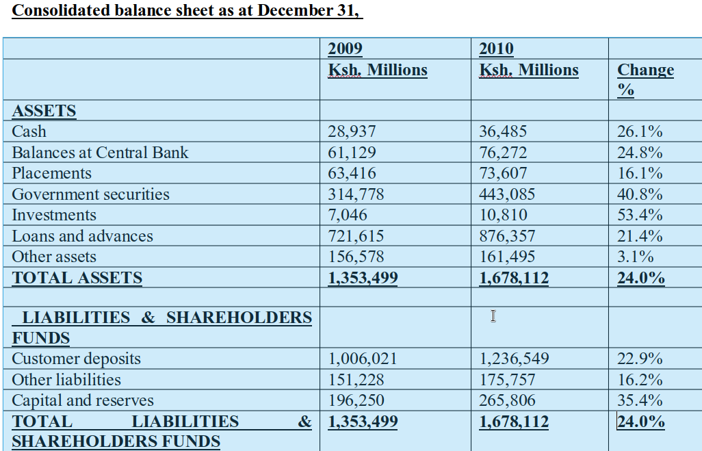
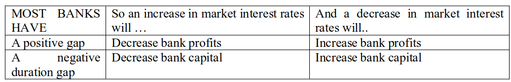
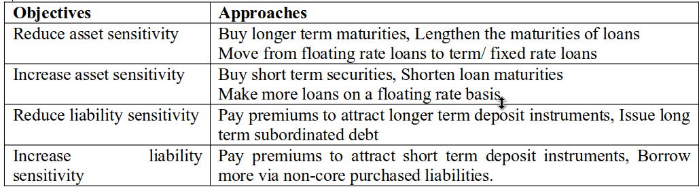

```{r setup, include=FALSE}
knitr::opts_chunk$set(echo = FALSE, warning = FALSE, message = FALSE)
```

## Background

In this topic we highlight the basics of managing deposit taking financial institutions with a focus on commercial banks. These principles could be applied to other deposit taking institutions like Sacco’s and microfinance institutions.

## The basics of commercial banking

### The bank balance sheet

Commercial banking is a business. Banks fill a market need by providing a service and earn a profit by charging customers for that service. The key commercial banking activities are taking in deposits from savers and making loans to households and firms. To earn a profit, a bank needs to pay less for the funds it receives from depositors than it earns on the loans it makes. We begin our discussion of the business of banking by looking at a bank’s sources of funds—primarily deposits—and uses of funds—primarily loans. 

A bank’s sources and uses of funds are summarized on its balance sheet. A balance sheet is a statement that shows an individual’s or a firm’s financial position on a particular day. The table below combines data from all the banks in the country into a consolidated balance sheet for Kenya commercial banking system. The typical layout of a balance sheet is based on the following accounting equation:

$Assets = Liabilities + Shareholders’ equity$

Figure 1 shows a consolidated balance sheet for commercial banks in Kenya for 2009 and 2010. 



### Assets 

An asset is something of value that an individual or a firm owns. A liability is something that an individual or a firm owes, or, in other words, a claim on an individual or a firm. Shareholders’ equity is the difference between the value of a firm’s assets and the value of its liabilities. Shareholders’ equity represents the amount the owners of the firm would be left with if the firm were to be closed, its assets sold, and its liabilities paid off. 

For a public firm, the owners are the shareholders. Shareholders’ equity is also referred to as the firm’s net worth. In banking, shareholders’ equity is usually called bank capital. Bank capital is the funds contributed by the shareholders through their purchases of the bank’s shares of stock plus the bank’s accumulated, retained profits. The accounting equation tells us that the left side of a firm’s balance sheet must always have the same value as the right side. We can think of a bank’s liabilities and its capital as the sources of its funds, and we can think of a bank’s assets as the uses of its funds.

### Bank Liabilities

The most important bank liabilities are the funds a bank acquires from savers (deposits). The bank uses the funds to makes investments or loans to borrowers. Banks offer a variety of deposit accounts because savers have different needs. Bank deposits offer households and firms certain advantages over other ways in which they might hold their funds. For example, compared with holding cash, deposits offer greater safety against theft and may also pay interest. Compared with financial assets such as Treasury bills, deposits are more liquid. Deposits against which checks can be written offer a convenient way to make payments.

- Checkable Deposits Banks offer savers checkable deposits, which are accounts against which depositors can write checks. Checkable deposits are also called transaction deposits. Checkable deposits come in many varieties, which are determined partly by banking regulations and partly by the desire of bank managers to tailor the checking accounts they offer to meet the needs of households and firms. Non-transaction Deposits Savers use only some of their deposits for day-to-day transactions. Banks offer non-transaction deposits for savers who are willing to sacrifice immediate access to their funds in exchange for higher interest payments. The most important types of non-transaction deposits are savings accounts, money market deposit accounts (MMDAs), and fixed/ time deposits, or certificates of deposit (CDs).With savings accounts— which at one time were generally called passbook accounts—depositors must give the bank notice for a withdrawal.

- Borrowings Banks often have more opportunities to make loans than they can finance with funds they attract from depositors. To take advantage of these opportunities, banks raise funds by borrowing. A bank can earn a profit from this borrowing if the interest rate it pays to borrow funds is lower than the interest it earns by lending the funds to businesses and consumers. Borrowings include short-term loans from a bank’s foreign branches or other subsidiaries or affiliates, repurchase agreements, and discount loans from the central bank. 

The interbank market is the market in which banks make short-term loans—often just overnight—to other banks. The interest rate on these interbank loans is called the interbank rate. With repurchase agreements—otherwise known as “repos,” or RPs—banks sell securities, such as Treasury bills, and agree to repurchase them, typically the next day. Banks use repos to borrow funds from business firms or other banks, using the underlying securities as collateral. 

A corporation or another bank that buys the securities earns interest without any significant loss of liquidity. Repos are typically between large banks or corporations, so the degree of counterparty risk, or the risk that the other party to the transaction will default on its obligation, had been considered to be small. But during the financial crisis of 2008, it became clear that even a large firm might be quickly forced into bankruptcy, leaving the counterparties to its repos to suffer significant losses or a delay in accessing their funds, or both. 

### Bank Assets

Bank assets are acquired by banks with the funds they receive from depositors, with funds they borrow, with funds they acquired initially from their shareholders, and with profits they retain from their operations. A bank’s managers build a portfolio of assets that reflect both the demand for loans by the bank’s customers and the bank’s need to balance returns against risk, liquidity, and information costs. We now discuss the key bank assets.

- Reserves and Other Cash Assets 

The most liquid asset that banks hold is reserves, which consist of vault cash—cash on hand in the bank (including ATMs) or in deposits at other banks—and deposits banks have with the Central bank. The CBK mandates that banks hold a percentage of their demand deposits and NOW accounts as required reserves. Reserves that banks hold over and above those that are required are called excess reserves. Banks had long complained that the CBK’s failure to pay interest on the banks’ reserve deposits amounted to a tax because, at least with respect to required reserves, banks earned no interest on funds they could otherwise have used to make loans or purchase securities. 

- Securities Marketable securities 

These are liquid assets that banks trade in financial markets. Banks are allowed to hold securities issued by the Government and other government agencies, corporate bonds that received investment-grade ratings when they were first issued, and some limited amounts of municipal bonds, which are bonds issued by state and local governments. Because of their liquidity, bank holdings of Government Treasury securities are sometimes called secondary reserves. 

- Loans 

The largest category of bank assets is loans. Loans are illiquid relative to marketable securities and entail greater default risk and higher information costs. As a result, the interest rates on loans are higher than those on marketable securities. Most bank loans fall into three categories: (1) loans to businesses—called commercial and industrial, or C&I, loans; (2) consumer loans, made to households primarily to buy automobiles, furniture, and other goods; and (3) real estate loans, which include mortgage loans and any other loans backed with real estate as collateral. Mortgage loans made to purchase homes are called residential mortgages, while mortgages made to purchase stores, offices, factories, and other commercial buildings are called commercial mortgages.

- Other Assets 

Other assets include banks’ physical assets, such as computer equipment and buildings. This category also includes collateral received from borrowers who have defaulted on loans. Following the bursting of the housing bubble, many banks ended up owning significant numbers of houses and residential lots as borrowers and developers defaulted on their mortgages.

### Bank Capital

Bank capital, also called shareholders’ equity, or bank net worth, is the difference between the value of a bank’s assets and the value of its liabilities.  A bank’s capital equals the funds contributed by the bank’s shareholders through their purchases of stock the bank has issued plus accumulated retained profits. Note that as the value of a bank’s assets or liabilities changes, so does the value of the bank’s capital.

### Bank Capital and Bank Profits

As with any other business, a bank’s profits are the difference between its revenues and its costs. A bank’s revenues are earned primarily from interest on its securities and loans and from fees it charges for services such as credit cards, servicing deposit accounts, and carrying out foreign exchange transactions. A bank’s costs are the interest it pays to its depositors, the interest it pays on loans or other debt, and its costs of providing its services. A bank’s net interest margin is the difference between the interest it receives on its securities and loans and the interest it pays on deposits and debt, divided by the total value of its earning assets.

$Net Interest Margin = \frac{Interest received from securities, loans, etc}{Total Interest Earning Assets}$

If we subtract the bank’s cost of providing its services from the fees it receives, divide the result by the bank’s total assets, and then add the bank’s net interest margin, we have an expression for the bank’s total profits earned per Shilling of assets, which is called its return on assets (ROA). 

$ROA = \frac{After Tax Profits}{Bank Assets}$

A bank’s shareholders own the bank’s capital and are interested in the profits the bank’s managers are able to earn on their investment. So, shareholders often judge bank managers not on the basis of ROA but on the basis of return on equity (ROE). Return on equity is after-tax profit per Shilling of equity, or bank capital:

$ROA = \frac{After Tax Profits}{Bank Capital}$

### Leverage

A measure of how much debt an investor assumes in making an investment. Bank leverage The ratio of the value of a bank’s assets to the value of its capital, the inverse of which (capital to assets) is called a bank’s leverage ratio.

$Bank Leverage = \frac{Total Bank Assets}{Bank Capital}$

$Leverage Ratio = \frac{Bank Capital}{Total Bank Assets}$

In two respects, moral hazard can contribute to high bank leverage. First, bank managers are typically compensated at least partly on the basis of their ability to provide shareholders with a high ROE. Particularly if managers do not themselves own significant amounts of stock in the bank, they may have an incentive to take on more risk than shareholders would prefer. 

Second, deposit protection has increased moral hazard by reducing the incentive depositors have to monitor the behavior of bank managers. To deal with this risk, government regulations called minimum capital requirements have placed limits on the value of the assets commercial banks can acquire relative to their capital. A commercial bank, for example, is required to maintain a minimum core 1capital of Ksh. 1 billion by 31st December 2012. The total capital (Core capital + Supplementary2 capital) must be at least 8% of the risk adjusted assets. The BASEL ACCORDS are international agreements that specify minimum capital for banks.

## Managing Bank Risk

In addition to risks that banks may face from inadequate capital relative to their assets, banks face several other types of risk. In this section, we examine how banks deal with the following three types of risks: liquidity risk, credit risk, and interest-rate risk.

### Managing Liquidity Risk

Liquidity risk refers to the possibility that a bank may not be able to meet its cash needs by selling assets or raising funds at a reasonable cost. For example, large deposit withdrawals might force a bank to sell relatively illiquid loans, possibly suffering losses on the sales. The challenge to banks in managing liquidity risk is to reduce their exposure to risk without sacrificing too much profitability. 

For example, a bank can minimize liquidity risk by holding fewer loans and securities and more reserves. Such a strategy reduces the bank’s profitability, however, because the bank earns no interest on vault cash and no interest rate on its reserve deposits with the CBK. So, rather than hold large amounts of excess reserves, banks typically reduce liquidity risk through strategies of asset management and liquidity management. Banks can practice asset management by lending funds in the interbank market, usually for one day at a time. 

Normally, banks can earn a higher interest rate by lending to other banks in the interbank market than they can by keeping the funds on deposit with the CBK. A second option is to use reverse repurchase agreements (Reverse Repos), which involve a bank buying Government securities owned by a business or another bank while at the same time agreeing to sell the securities back at a later date, often the next morning. (With a repurchase agreement, the bank would sell the Treasury securities and agree to buy them back at a later date.). 

The reverse repurchases agreement acts, in effect, as a short-term loan from the bank to a business or other bank with the Government securities acting as collateral. Most banks use a combination of loans in the interbank market and reverse repurchase agreements. Because the loans in the interbank market and repurchase agreements are very short term, the funds can be available to meet deposit withdrawals.

Banks can also meet a surge in deposit withdrawals by increasing their liabilities—borrowings—rather than by increasing their reserves. Liability management involves determining the best mix of borrowings needed to obtain the funds necessary to satisfy deposit withdrawals. Banks can borrow from other banks in the interbank market, borrow from businesses or other banks using repurchase agreements, or borrow from the CBK by taking out discount loans.

### Managing Credit Risk
Credit risk is the risk that borrowers might default on their loans. Credit risk can arise because asymmetric information often results in the problems of adverse selection and moral hazard. Because borrowers know more about their financial health and their true plans for using borrowed money, banks may find themselves inadvertently lending to poor credit risks or to borrowers who intend to use borrowed funds for something other than their intended purpose. We now briefly consider the different methods banks can use to manage credit risk. 

- Diversification 

Investors—whether individuals or financial firms—can reduce their exposure to risk by diversifying their holdings. If banks lend too much to one borrower, to borrowers in one region, or to borrowers in one industry, they are exposed to greater risks from those loans. For example, a bank that had granted most of its loans to consumers and business in Tokyo would have suffered serious losses on those loans following the earthquake and nuclear disaster in 2011. By diversifying across borrowers, regions, and industries, banks can reduce their credit risk.

- Credit-Risk Analysis 

In performing credit-risk analysis, bank loan officers screen loan applicants to eliminate potentially bad risks and to obtain a pool of creditworthy borrowers. Individual borrowers usually must give the loan officer information about their employment, income, and net worth. Business borrowers supply information about their current and projected profits and net worth. Banks often use credit-scoring systems to predict statistically whether a borrower is likely to default. For example, individuals who change jobs frequently are more likely to default than are people with more stable job histories. 

Loan officers not only collect information before granting a loan, they also monitor the borrower during the term of the loan. Historically, loan rates to businesses were based on the prime rate, which was the interest rate charged on six-month loans to borrowers with the lowest expected default risk—so-called high-quality borrowers. Other loans carried interest rates greater than the prime rate, according to their credit risk. Higher-risk loans had higher interest rates. Today, however, banks charge most large- to medium-sized businesses interest rates that reflect changing market interest rates instead of the stated prime rate, which is typically charged only to smaller borrowers.

- Collateral 

To combat problems of adverse selection, banks also generally require that a borrower put up collateral, or assets pledged to the bank in the event that the borrower defaults. For example, an entrepreneur who needs a bank loan to start a new business will likely be asked by the bank to pledge some of her financial assets or her house as collateral. In addition, the bank might require the entrepreneur to maintain a compensating balance, a required minimum amount that the business taking out the loan must maintain in a checking account with the lending bank.

- Credit Rationing 

In some circumstances, banks minimize the costs of adverse selection and moral hazard through credit rationing.  In credit rationing, the bank either grants a borrower’s loan application but limits the size of the loan or simply declines to lend any amount to the borrower at the current interest rate. The first type of credit rationing occurs in response to possible moral hazard. Limiting the size of bank loans reduces costs of moral hazard by increasing the chance that the borrower will repay the loan to maintain a sound credit rating. 

Banks place credit limits on the MasterCard and Visa cards they issue for the same reason. With a credit limit of Ksh.2,500 on your credit card, you are likely to repay the bank so that you can borrow again in the future. If the bank were willing to give you a Ksh.2.5 million credit limit, you might be tempted to spend more money than you could repay. So, limiting the size of borrowers’ loans to amounts less than borrowers demand at the current interest rate is both rational and profit maximizing for banks.

The second type of credit rationing occurs in response to the adverse selection problem that arises when borrowers have little or no collateral to offer banks. What if a bank tries to raise the interest rate it charges to compensate itself for the higher default risk such borrowers represent? If the bank cannot distinguish the low-risk borrowers in this group from the high-risk borrowers, it runs the risk of having the low risk borrowers drop out of the loan pool because of the high interest rate, leaving only the high-risk borrowers. So, keeping the interest rate at the lower level and denying loans altogether to some borrowers can be in the bank’s best interest.

- Monitoring and Restrictive Covenants 

To reduce the costs of moral hazard, banks monitor borrowers to make sure they don’t use the funds borrowed to pursue unauthorized, risky activities. Banks keep track of whether borrowers are obeying restrictive covenants or explicit provisions in the loan agreement that prohibit the borrower from engaging in certain activities. A business borrowing money to pay for new equipment might be explicitly barred from using the money to meet its payroll obligations or to finance inventories.

- Long-Term Business Relationships 

The ability of banks to assess credit risks on the basis of private information on borrowers is called relationship banking. One of the best ways for a bank to gather information about a borrower’s prospects or to monitor a borrower’s activities is for the bank to have a long-term business relationship with the borrower. 

By observing the borrower over time—through the borrower’s checking account activity and loan repayments—the bank can significantly reduce problems of asymmetric information by reducing its information gathering and monitoring costs. Borrowers also gain from long-term relationships with banks. The customer can obtain credit at a lower interest rate or with fewer restrictions because the bank avoids costly information-gathering tasks.

### Managing Interest-Rate Risk

Banks experience interest-rate risk if changes in market interest rates cause bank profits or bank capital to fluctuate. The effect of a change in market interest rates on the value of a bank’s assets and liabilities is similar to the effect of a change in interest rates on bond prices. That is, a rise in the market interest rate will lower the present value of a bank’s assets and liabilities, and a fall in the market interest rate will raise the present value of a bank’s assets and liabilities. The effect of a change in interest rates on a bank’s assets and liabilities depends in part on whether the assets or liabilities are variable rate or fixed rate. The interest rate on a variable-rate asset or liability changes at least once per year, while the interest rate on a fixed-rate asset or liability changes less often.

**Measuring Interest-Rate Risk**: Gap Analysis and Duration Analysis
Managers use gap analysis and duration analysis to measure how vulnerable their banks are to interest-rate risk. Gap analysis looks at the difference, or gap, between the Shilling value of a bank’s variable-rate assets and the Shilling value of its variable-rate liabilities. Most banks have negative gaps because their liabilities—mainly deposits—are more likely to have variable rates than are their assets—mainly loans and securities. 

In practice, though, a bank manager will conduct a more sophisticated analysis that takes into account the fact that different assets and liabilities are likely to experience different changes in interest rates. In addition to affecting a bank’s profits, changes in interest rates can affect a bank’s capital by changing the value of the bank’s assets and liabilities. You know that the longer the maturity of a financial asset, the larger the change in the asset’s price as a result of a given change in interest rates. 

During the 1930s, Frederick Macaulay, an economist at the National Bureau of Economic Research, developed the concept of duration as a more precise measure than maturity of the sensitivity of a financial asset’s price to changes in the interest rate. The longer the duration of a particular bank asset or bank liability, the more the value of the asset or liability will change as a result of a change in market interest rates. Duration analysis measures how sensitive a bank’s capital is to changes in market interest rates. A bank’s duration gap is the difference between the average duration of the bank’s assets and the average duration of the bank’s liabilities. If a bank has a positive duration gap, the duration of the bank’s assets is greater than the duration of the bank’s liabilities. 

In this case, an increase in market interest rates will reduce the value of the bank’s assets more than the value of the bank’s liabilities, which will decrease the bank’s capital. Banks typically have positive duration gaps because their assets—mainly loans and securities—have longer durations than their liabilities—mainly deposits. We summarize gap and duration analysis in the Table below. We can conclude that falling market interest rates are typically good news for banks because they will increase bank profits and the value of bank capital, while rising market interest rates are bad news for banks because they will decrease bank profits and the value of bank capital.



### Reducing Interest-Rate Risk

 Bank managers can use a variety of strategies to reduce their exposure to interest-rate risk. Banks with negative gaps can make more adjustable-rate or floating-rate loans. That way, if market interest rates rise and banks must pay higher interest rates on deposits, they will also receive higher interest rates on their loans. Unfortunately for banks, many loan customers are reluctant to take out adjustable-rate loans because although the loans reduce the interest-rate risk banks face, they increase the interest-rate risk borrowers’ face. 
 
 For example, if you buy a house using an adjustable-rate mortgage (ARM), your monthly payments will decline when market interest rates fall but rise if market interest rates rise. Many borrowers do not want to assume this interest-rate risk, so the great majority of residential mortgage loans are granted with fixed rates. Similarly, adjustable-rate car loans are rare. Fortunately, banks are able to sell many of their long-term loans as part of the securitization process that you have already discussed in BCOM 330. In addition, many bank loans are granted to businesses and are short-term, variable-rate loans where the interest-rate risk is not very large. 
 
 Banks can use interest-rate swaps in which they agree to exchange, or swap, the financial firm. Swaps allow banks to satisfy the demands of their loan customers for fixed-rate loans while still reducing exposure to interest-rate risk. Banks can also enter into futures contracts and options contracts that can help hedge interest-rate risk. 
 
 


