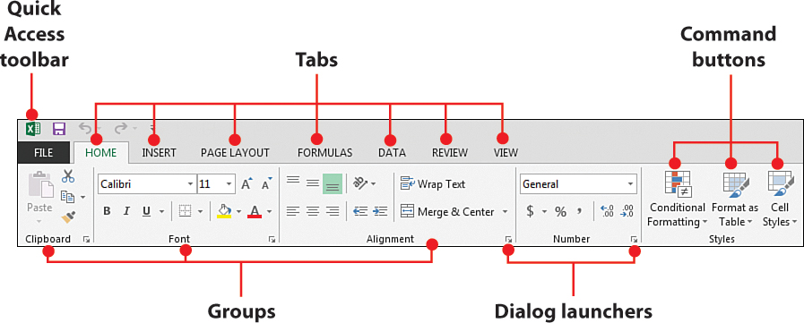
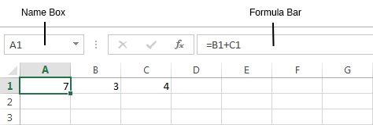
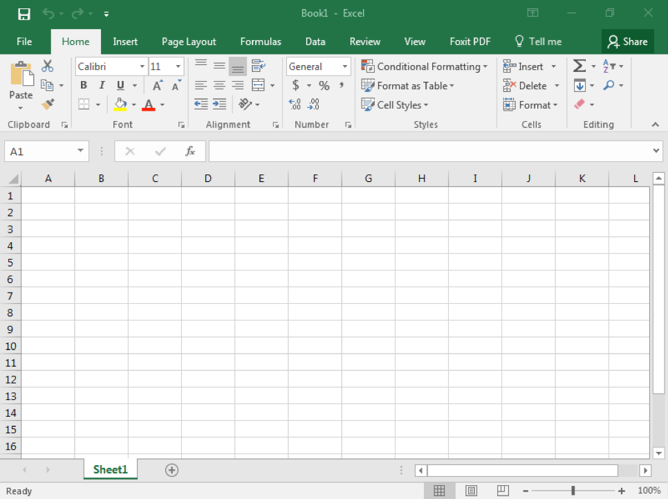
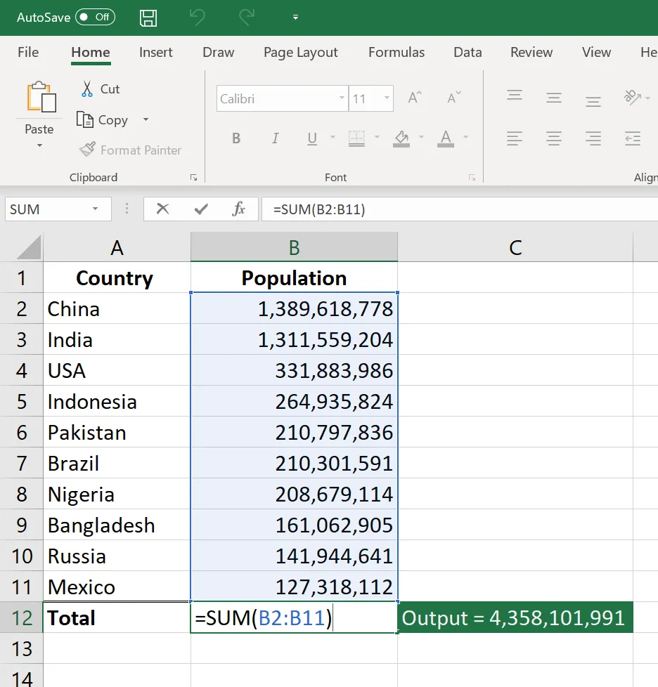

<!-- UNCOMMENT TO ADD A WATERMARK. ENSURE APPROPRIATE PACKAGES ARE INCLUDED IN YAML/LATEX HEADER -->
<!-- \AddToShipoutPictureFG{ -->
<!--   \AtPageCenter{% or \AtTextCenter -->
<!--     \makebox[0pt]{\rotatebox[origin=c]{60}{% -->
<!--       \scalebox{12}{\texttransparent{0.08}{DRAFT}}% -->
<!--     }} -->
<!--   } -->
<!-- } -->

```{r setup, include=FALSE}
library(knitr)
library(tidyverse)
theme_set(theme_bw())
opts_chunk$set(echo=FALSE, warning=FALSE, message=FALSE, fig.align="center")
opts_chunk$set(echo=FALSE, warning=FALSE, message=FALSE, fig.align="center", fig.pos="H")
```

\newpage

# Background

*Ms Excel* remains the most popular spreadsheet program globally [] despite the rise of alternative spreadsheet software like Google Sheets and specialised data analysis programming languages like `R` and `Matlab`. Researchers estimate that at least () billion people rely on Ms Excel to manage their data. [Excel](https://medium.com/swlh/who-runs-the-world-microsoft-excel-f8cf2685d013) is especially ubiquitous in Finance and Accounting fields. Hence, a good grasp of Ms Excel is among the most sought after skills among business professionals ^[Please follow <https://medium.com/swlh/who-runs-the-world-microsoft-excel-f8cf2685d013> for an examination of the extent to which businesses around the world rely on Excel for data analysis]. In this course, we will explore Ms Excel and its application to finance and accounting. By the end of the module, each candidate should have a solid understanding of Excel beyond the basics. These excel skills will form the basis for analysing financial statements and financial modelling topics that follow later. 

Beyond the course notes, please take time to watch Excel tutorials on `Youtube` and other online resources and university library resources. 

## Assumptions
The course assumes that each student has:

- Basic computer literacy, such as starting a computer program. 
- Access to Ms Excel 2010 or later. The University computer lab is well equiped with computers. If you need a reservation to use the lab, kindly inform the course instructor.

We now start by examining the structure of Ms Excel, beginning with the Ribbon.

## The Ribbon

When you launch *Ms Excel*, the top of the spreadsheet contains the `Ribbon`, a familiar feature for those who have used the spreadsheet before. Regardless of the version of Excel that you are using, you should see something similar to Figure 1. Take note of the Ribbon key components: Quick access toolbar, Tabs, Command buttons, Groups and Dialogue launchers ^[Source: <https://www.informit.com/articles/article.aspx?p=2067634>.]. We shall discuss the Tabs next. 



The Ribbon contains the following Tabs. 

- **HOME**: This tab houses frequently used commands, including formatting like changing fonts, font colours, and text alignment. 

- **INSERT**: Used for adding objects into the spreadsheets. For instance, you could add a photo or symbol.

- **PAGE LAYOUT**: Used for altering the appearance of sheets, for instance, whether a page is a portrait or landscape. 

- **FORMULAS**: The formula tab groups all Excel formulas into various categories.

- **DATA**: The Data tab allows for data management like sorting. 

- **REVIEW**: The review tab allows one to proofread text, make comments, and protect the workbook. 

- **VIEW**: The view tab allows for the customisation of the excel sheets. For example, one could change the view of the excel sheets. 

The Ribbon in your Excel sheet could have extra Tabs. Note that you can always add extra Tabs (for instance, the Developer Tab) in the Excel Ribbon, which we learn later. 

## The Name Box and Formula Bar

Just below the ribbon, there are two key components. 

- The Name Box, which displays the name of a highlighted cell. 

- The formula bar allows for the editing of Excel formulas. 



## The Working Area

The rows and columns of a spreadsheet form the working area (see Figure 2). The working area consists of rows (labelled from 1) and columns (labelled starting from letter A). It is in the working area that we enter and view our data. 

## Entering Data into an Excel sheet.

For a start, we need to distinguish two terms.

- Excel sheet.

- Excel workbook. 

Think of these terms as you would an exercise book. A single page is a sheet within the larger exercise book. Thus an Excel sheet is just one part of a workbook. Note that once you launch Excel, you open a workbook with only one sheet named `sheet1`. The analogy here is that you have a (work) book with one page (sheet). You can see the name of the sheet by checking the bottom left of the workbook. However, you can add additional sheets by clicking on the `+` button next to the name of the open sheet (on the bottom left). Hence, your workbook starts with one sheet by default, but you can always add additional sheets to make a (work) book with many pages (sheets). 

### The Look and Range of an Excel Sheet

Figure 3 shows a sample page of an Excel sheet. 



The columns of an Excel sheet have upper case English alphabet labels, starting from A. The rows, on the other hand, are numbered from 1. An Excel sheet has 16,384 columns and 1,048,576 rows []. To refer to a cell, always start with the column reference followed by the row reference, meaning that a cell reference always starts with an alphabet. 

**Exercise 1**

1. Open an excel workbook and identify the following cells on Sheet1.

- A1
- F12
- AB2

2. Add a second worksheet and name it "My_second_worksheet". The default name of the new worksheet is Sheet2. Right-click on the name and select rename. Then type in the new preferred name.

3. Click on cell A1 in sheet1 and type "BBM 419: Financial statements analysis". 

4. Convert the text you typed in Q3 to BOLD and change the font colour to DARK BLUE. 

5. Still on sheet1 and starting from cell D7 going down, type the days of the week starting from Monday. 

6. Starting from the adjacent cell E7 going down, type the numbers 1 to 7. Notice how Excel aligns text and numbers by default.  We shall use the data you just generated to learn how to format documents. 

7. Save your document on your computer Desktop under the name `BBM_419_Excel_Exercises`. Once you close your spreadsheet and check your Desktop, you should see your workbook as `BBM_419_Excel_Exercises.xlsx`. To open it, you need to double click on the document. 

8. Click on any cell in your worksheet and then press the following key combinations. Note that you must press the keys together. 

- `Ctrl+Space_bar`.
- `Shift+Space_bar`.

What happens in each case? The former should highlight the entire column, while the latter highlights the whole row. These are convenient shortcuts in Ms Excel. 

9. You can also use the mouse to select a row or column. Find out how. Similarly, you can resize, add and delete rows and columns using a mouse. How do you go about this?

## Entering and Editing Data into a Cell of an Excel Sheet

As seen in Exercise 1, once you highlight a cell, you can directly type in data. Once you enter the data, you can exit the cell by:

- Using the `Enter` key. This action will shift the highlight to the cell below.
- Using the `Tab` key, which shifts the highlight to the cell on the right.
- Using the `arrow` keys. Here, the cell highlight could shift up, down, left or right depending on the arrow key you press. 

Note that if you enter data into a cell by mistake, you can immediately press the `Esc` key to remove the data. Note that this works if you have NOT already pressed Enter, Tab or Arrow keys. 

Once you enter data into a cell, you can always edit it by highlighting the cell and double-clicking it. Alternatively, you can highlight the cell then press the `F2` key to activate cell editing. To delete data from a cell, you highlight the cell and press the `Delete` key. Alternatively, you can use the `Clear` command from the file menu. Note that the clear command is much more potent as it removes the contents of a cell and all the formatting like colours. Delete, on the other hand, removes only text from a cell. 

# Formating an Excel Worksheet

There are two ways to format a document in Excel. 

- Through the `Home` Tab that provides a variety of formatting tools. 

- Highlight the data you want, then right-click and select format cells. Alternatively, you can access the format cells button using the key combination, `Ctrl+1`. Try it!! 

You can format cells by changing font size, font colour, cell fill, text alignment, among others. We use the exercise below to learn how to format cells in Excel. 

**Exercise 2**

Open the attached Ms Excel workbook. The workbook contains disorganised data. Let us manage the information as follows. 

- Select all the data and change the fill of the cells to white.
- Align all the text columns to the left.
- Align the last column to the right.
- The first row contains titles. Align this row to the top. 
- Change the font of the title row to `dark blue` and make the font `bold`.
- Place a border below the title row. 

Note that you now have a better-looking document. 


# Introduction to Ms Excel Formulas

One strength of Ms Excel is that it allows for the calculation of numeric values using formulas. To start a formula, just activate the desired cell and type `=` or `+`. These two signs tell Excel that you are about to type a formula. The `=` sign is much more commonly used. Figure 4 shows a sample formula for summing up the populations of countries using the `SUM` function. 



In writing formulas, you could either enter the figures directly or use cell references. The advantage of using cell referencing is that the results update automatically if the figure in any of the referenced cells changes. The following arithmetic operators are accepted by Excel.

- `+` for addition.
- `-` for subtraction.
- `*` for multiplication.
- `/` for division.
- `^` for degree elevation.
- `()` for specifying the order of operations.

# Introduction to Ms Excel Functions


```{r, echo=FALSE}
knitr::knit_exit()
```


```{r, out.height="6in", fig.align='center', fig.cap="This is the caption.", eval=FALSE, include=FALSE}
knitr::include_graphics("/path/image.png")
```


<!-- See Rmd source. Uncomment and adjust YAML header as necessary to see these. -->

<!-- \color{OliveGreen} -->
<!-- Some green text. Must uncomment `usepackage[dvipsnames]{xcolor}` in YAML header. -->
<!-- \color{black} -->

<!-- To include an attachment, uncomment the line below and add `usepackage[final]{pdfpages}` to header. -->
<!-- \includepdf[pages=-]{path-to-pdf-to-attach.pdf}  -->
